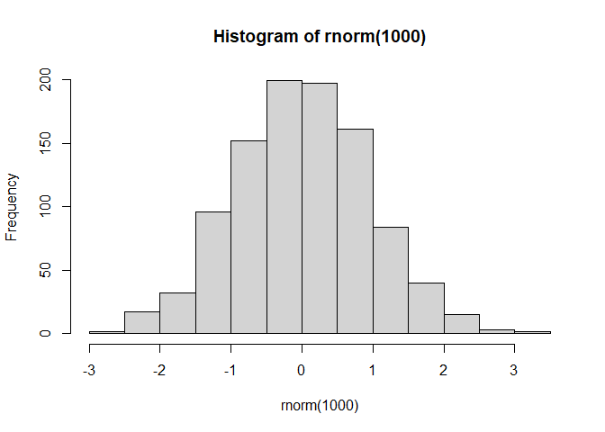
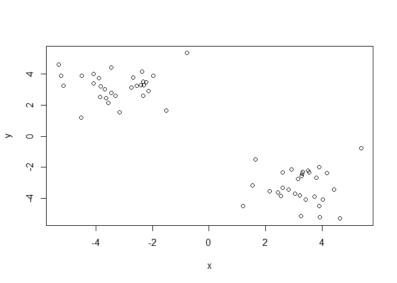
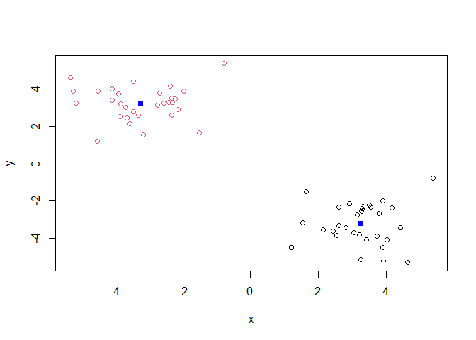
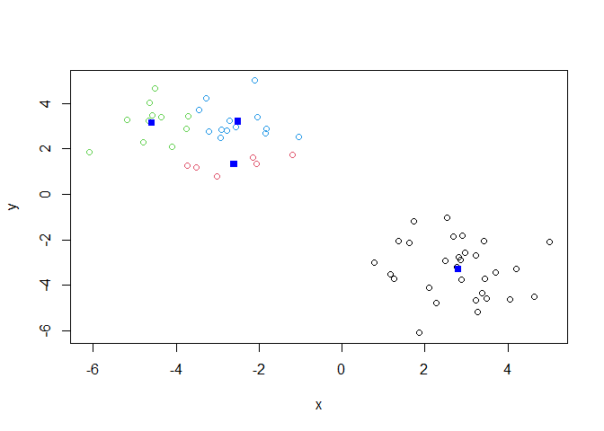
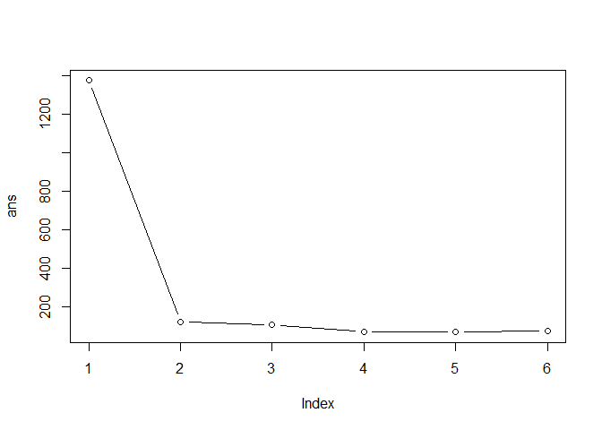
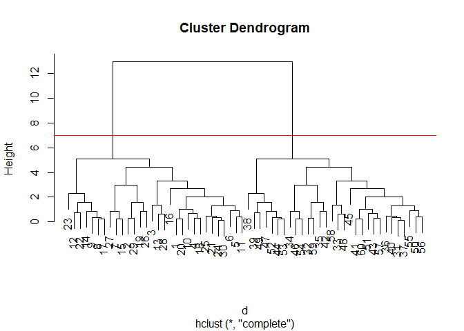
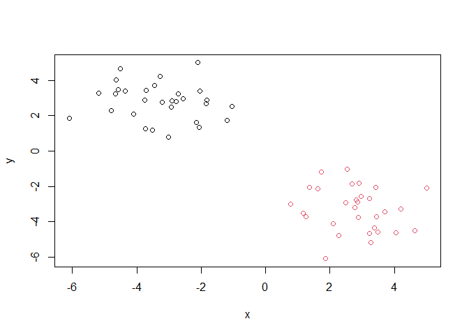
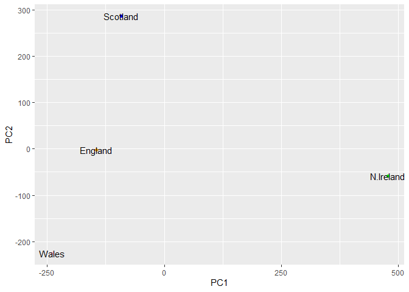

# Class 7: Machine Learning 1
Shazreh Hassan (PID: A13743949)

Today we will begin our exploration of some “classical” machine learning
approaches. We will start with clustering:

Let’s first make up some data to cluster where we know what the answer
should be.

``` r
hist(rnorm(1000))
```



``` r
x <- c(rnorm(30,mean=-3),rnorm(30, mean=3))
y <- rev(x)

x <- cbind(x,y)
head(x)
```

                 x        y
    [1,] -2.399974 3.282015
    [2,] -2.144117 2.917248
    [3,] -4.066335 4.012487
    [4,] -3.641140 2.438093
    [5,] -2.316879 2.604188
    [6,] -3.815633 3.213341

Peak at x with `plot()`

``` r
plot(x)
```



The main function in “base” R for K-means clustering is called
`kmeans()`. - requires x and centers arguments

``` r
k <- kmeans(x, centers=2)
k
```

    K-means clustering with 2 clusters of sizes 30, 30

    Cluster means:
              x         y
    1  3.238310 -3.231164
    2 -3.231164  3.238310

    Clustering vector:
     [1] 2 2 2 2 2 2 2 2 2 2 2 2 2 2 2 2 2 2 2 2 2 2 2 2 2 2 2 2 2 2 1 1 1 1 1 1 1 1
    [39] 1 1 1 1 1 1 1 1 1 1 1 1 1 1 1 1 1 1 1 1 1 1

    Within cluster sum of squares by cluster:
    [1] 60.49366 60.49366
     (between_SS / total_SS =  91.2 %)

    Available components:

    [1] "cluster"      "centers"      "totss"        "withinss"     "tot.withinss"
    [6] "betweenss"    "size"         "iter"         "ifault"      

> Q. How big are the clusters (i.e. their size)?

``` r
k$size
```

    [1] 30 30

> Q. What clusters do my data points reside in?

``` r
k$cluster
```

     [1] 2 2 2 2 2 2 2 2 2 2 2 2 2 2 2 2 2 2 2 2 2 2 2 2 2 2 2 2 2 2 1 1 1 1 1 1 1 1
    [39] 1 1 1 1 1 1 1 1 1 1 1 1 1 1 1 1 1 1 1 1 1 1

> Q. Make a plot of our data colored by cluster assignment - make a
> result figure.

``` r
plot(x, col=k$cluster)
points(k$centers, col="blue", pch=15)
```



> Q. Now make 4 clusters instead of 2 and plot:

``` r
k4 <- kmeans(x, centers=4)
plot(x, col=k4$cluster)
points(k4$centers, col="blue", pch=15)
```



> Q. Run kmeans with values centered (i.e. values of k) equal 1 to 6.

- tot.withinss is a metric of how good the clusters are (sum of
  squares) - we want to store this

Use a for loop:

``` r
ans <- NULL
for(i in 1:6) {
  ans <- c(ans,kmeans(x,centers=i)$tot.withinss)
}

ans
```

    [1] 1376.61030  120.98733  105.97105   68.71187   67.44201   72.75860

Make a “scree-plot”

``` r
plot(ans, type="b")
```



- the inflection point at 2 shows us where the minimum number of
  clusters are needed for a small sum of squares - the scree point
  - gives you justification for which k you choose
- but you are imposing structure on the data
  - heirarchical clustering accounts for this

## Heirarchical Clustering

The main function in “base” R for this is called `hclust()` - can work
with sequence identity and other non-Euclidian distances, while kmeans
requires Euclidian distance

``` r
#matrix of distances between points
d <-dist(x)

#now run hclust
hc <- hclust(d)
hc
```


    Call:
    hclust(d = d)

    Cluster method   : complete 
    Distance         : euclidean 
    Number of objects: 60 

``` r
plot(hc)
abline(h=7, col="red")
```



- height is a measure of the distance that things are joined together

To obtain clusters from our `hclust` result object **hc**, we cut the
tree to yield different sub branches. For this, we use the `cutree()`
function

``` r
grps <- cutree(hc,h=7)
grps
```

     [1] 1 1 1 1 1 1 1 1 1 1 1 1 1 1 1 1 1 1 1 1 1 1 1 1 1 1 1 1 1 1 2 2 2 2 2 2 2 2
    [39] 2 2 2 2 2 2 2 2 2 2 2 2 2 2 2 2 2 2 2 2 2 2

``` r
plot(x, col=grps)
```



## Principal component analysis

- first PC (eigenvector) is the best fit to data that maximizes spread
  (variance) of the data
- second PC captures the rest of the variance
- first and second PC make up the new axes for the data

> Q1. How many rows and columns are in your new data frame named x? What
> R functions could you use to answer this questions?

``` r
x <- read.csv("https://bioboot.github.io/bggn213_F25/class-material/UK_foods.csv")
dim(x)
```

    [1] 17  5

ans: 17 rows and 5 columns

``` r
## Preview the first 6 rows
#View(x[1:6,])
```

Here it appears that the row-names are incorrectly set as the first
column of our x data frame (rather than set as proper row-names). This
is very common error. Lets try to fix this up with the following code,
which sets the rownames() to the first column and then removes the
troublesome first column (with the -1 column index):

``` r
rownames(x) <- x[,1]
y <- x[,-1]
head(y)
```

                   England Wales Scotland N.Ireland
    Cheese             105   103      103        66
    Carcass_meat       245   227      242       267
    Other_meat         685   803      750       586
    Fish               147   160      122        93
    Fats_and_oils      193   235      184       209
    Sugars             156   175      147       139

``` r
dim(y)
```

    [1] 17  4

- could also write `read.csv(url,row.names=1)` to avoid having to do
  this

> Q2. Which approach to solving the ‘row-names problem’ mentioned above
> do you prefer and why? Is one approach more robust than another under
> certain circumstances?

The row.names=1 is a better option because running the \[,-1\] code
multiple times removes multiple columns.

## Spotting major differences and trends

``` r
barplot(as.matrix(y), beside=T, col=rainbow(nrow(y)))
```


> Q3: Changing what optional argument in the above barplot() function
> results in the following plot?

``` r
barplot(as.matrix(y), beside=FALSE, col=rainbow(nrow(y)))
```


ans: beside=FALSE (the default)

> Q5: Generating all pairwise plots may help somewhat. Can you make
> sense of the following code and resulting figure? What does it mean if
> a given point lies on the diagonal for a given plot?

``` r
pairs(y, col=rainbow(10), pch=16)
```


ans: Each plot is a pairwise scatterplot between two countries. The
country on each axis is the name written within the same column (for x)
or row (for y). The plots are mirrored across the diagonal of plots. If
points are along a diagonal within a plot, that means the two countries
being compared eat similar amounts of the foods those points represent.

> Q6. What is the main differences between N. Ireland and the other
> countries of the UK in terms of this data-set?

ans: There is higher consumption of the food group represented by the
blue dot in N. Ireland compared to the other countries. Overall, Wales
and England are similar in their consumption of these foods. But it is
difficult to tell what is going on in the dataset.

## PCA to the rescue

The main function in “base” R for PCA is `prcomp()`.

As we want to do PCA on the food data across countries, we will want
foods in the columns. We want to transpose the data.

``` r
pca <- prcomp(t(y))
summary(pca)
```

    Importance of components:
                                PC1      PC2      PC3       PC4
    Standard deviation     324.1502 212.7478 73.87622 3.176e-14
    Proportion of Variance   0.6744   0.2905  0.03503 0.000e+00
    Cumulative Proportion    0.6744   0.9650  1.00000 1.000e+00

> Q7. Generate a plot of PC1 vs PC2. The second line adds text labels
> over the data points. Q8. Customize your plot so that the colors of
> the country names match the colors in our UK and Ireland map and table
> at start of this document

Our result object is called `pca`and it has a `$x` component that we
will look at first

``` r
#start making low dimensional figure summarizing the data
pca$x
```

                     PC1         PC2        PC3           PC4
    England   -144.99315   -2.532999 105.768945 -4.894696e-14
    Wales     -240.52915 -224.646925 -56.475555  5.700024e-13
    Scotland   -91.86934  286.081786 -44.415495 -7.460785e-13
    N.Ireland  477.39164  -58.901862  -4.877895  2.321303e-13

``` r
library(ggplot2)

cols=c("orange","pink","blue", "green")

ggplot(pca$x) +
  aes(PC1, PC2, label=rownames(pca$x)) +
  geom_point(col=cols)+
  geom_text()
```



Another major result out of PCA is the so-called “variable loadings” or
`$rotation` that tells us how the original variables (foods) contribute
to PCs (i.e. our new axis).

``` r
#how the variables contribute to first PC
ggplot(pca$rotation) +
  aes(PC1, rownames(pca$rotation)) +
  geom_col()
```


