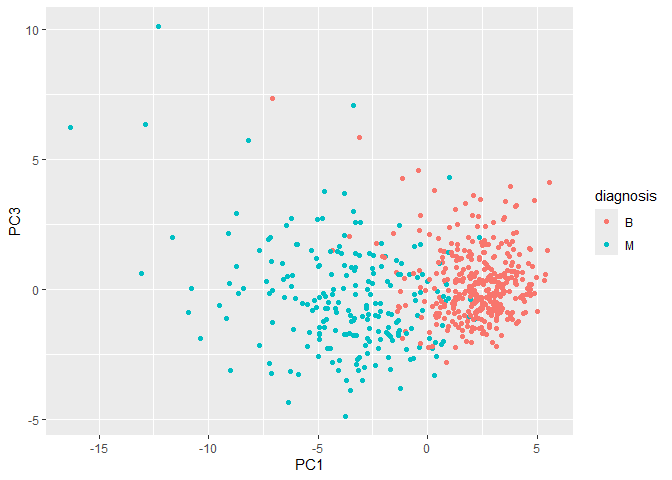
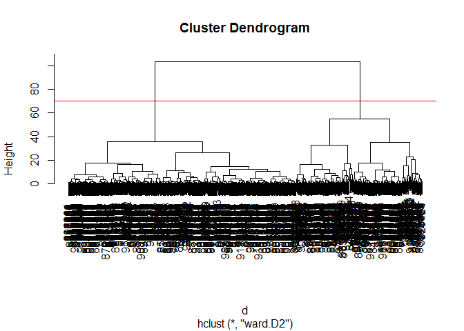

# Class 08: Breast Cancer Analysis Project
Shazreh Hassan (PID: A13743949)

- [Background](#background)
- [Data import](#data-import)
- [Exploratory data analysis](#exploratory-data-analysis)
- [Principal component analysis](#principal-component-analysis)
- [Interpreting PCA Results](#interpreting-pca-results)
- [Variance explained](#variance-explained)
- [Selecting number of clusters](#selecting-number-of-clusters)
- [Combining PCA and Clustering](#combining-pca-and-clustering)

## Background

The goal of this mini-project is to explore a complete analysis using
the unsupervised learning techniques covered in class. We’ll extend what
we’ve learned by combining PCA as a preprocessing step to clustering
using data that consist of measurements of cell nuclei of human breast
masses.

The data itself comes from the Wisconsin Breast Cancer Diagnostic Data
Set first reported by K. P. Benne and O. L. Mangasarian: “Robust Linear
Programming Discrimination of Two Linearly Inseparable Sets”.

Values in this data set describe characteristics of the cell nuclei
present in digitized images of a fine needle aspiration (FNA) of a
breast mass.

## Data import

``` r
fna.data <- "https://bioboot.github.io/bimm143_S20/class-material/WisconsinCancer.csv"
wisc.df <- read.csv(fna.data, row.names=1)

head(wisc.df)
```

             diagnosis radius_mean texture_mean perimeter_mean area_mean
    842302           M       17.99        10.38         122.80    1001.0
    842517           M       20.57        17.77         132.90    1326.0
    84300903         M       19.69        21.25         130.00    1203.0
    84348301         M       11.42        20.38          77.58     386.1
    84358402         M       20.29        14.34         135.10    1297.0
    843786           M       12.45        15.70          82.57     477.1
             smoothness_mean compactness_mean concavity_mean concave.points_mean
    842302           0.11840          0.27760         0.3001             0.14710
    842517           0.08474          0.07864         0.0869             0.07017
    84300903         0.10960          0.15990         0.1974             0.12790
    84348301         0.14250          0.28390         0.2414             0.10520
    84358402         0.10030          0.13280         0.1980             0.10430
    843786           0.12780          0.17000         0.1578             0.08089
             symmetry_mean fractal_dimension_mean radius_se texture_se perimeter_se
    842302          0.2419                0.07871    1.0950     0.9053        8.589
    842517          0.1812                0.05667    0.5435     0.7339        3.398
    84300903        0.2069                0.05999    0.7456     0.7869        4.585
    84348301        0.2597                0.09744    0.4956     1.1560        3.445
    84358402        0.1809                0.05883    0.7572     0.7813        5.438
    843786          0.2087                0.07613    0.3345     0.8902        2.217
             area_se smoothness_se compactness_se concavity_se concave.points_se
    842302    153.40      0.006399        0.04904      0.05373           0.01587
    842517     74.08      0.005225        0.01308      0.01860           0.01340
    84300903   94.03      0.006150        0.04006      0.03832           0.02058
    84348301   27.23      0.009110        0.07458      0.05661           0.01867
    84358402   94.44      0.011490        0.02461      0.05688           0.01885
    843786     27.19      0.007510        0.03345      0.03672           0.01137
             symmetry_se fractal_dimension_se radius_worst texture_worst
    842302       0.03003             0.006193        25.38         17.33
    842517       0.01389             0.003532        24.99         23.41
    84300903     0.02250             0.004571        23.57         25.53
    84348301     0.05963             0.009208        14.91         26.50
    84358402     0.01756             0.005115        22.54         16.67
    843786       0.02165             0.005082        15.47         23.75
             perimeter_worst area_worst smoothness_worst compactness_worst
    842302            184.60     2019.0           0.1622            0.6656
    842517            158.80     1956.0           0.1238            0.1866
    84300903          152.50     1709.0           0.1444            0.4245
    84348301           98.87      567.7           0.2098            0.8663
    84358402          152.20     1575.0           0.1374            0.2050
    843786            103.40      741.6           0.1791            0.5249
             concavity_worst concave.points_worst symmetry_worst
    842302            0.7119               0.2654         0.4601
    842517            0.2416               0.1860         0.2750
    84300903          0.4504               0.2430         0.3613
    84348301          0.6869               0.2575         0.6638
    84358402          0.4000               0.1625         0.2364
    843786            0.5355               0.1741         0.3985
             fractal_dimension_worst
    842302                   0.11890
    842517                   0.08902
    84300903                 0.08758
    84348301                 0.17300
    84358402                 0.07678
    843786                   0.12440

We used row.names=1 so that patient id would not be included. We also
want to remove diagnosis column:

``` r
diagnosis <-  as.factor(wisc.df$diagnosis)
wisc.data <- wisc.df[,-1]
dim(wisc.data)
```

    [1] 569  30

``` r
head(wisc.data)
```

             radius_mean texture_mean perimeter_mean area_mean smoothness_mean
    842302         17.99        10.38         122.80    1001.0         0.11840
    842517         20.57        17.77         132.90    1326.0         0.08474
    84300903       19.69        21.25         130.00    1203.0         0.10960
    84348301       11.42        20.38          77.58     386.1         0.14250
    84358402       20.29        14.34         135.10    1297.0         0.10030
    843786         12.45        15.70          82.57     477.1         0.12780
             compactness_mean concavity_mean concave.points_mean symmetry_mean
    842302            0.27760         0.3001             0.14710        0.2419
    842517            0.07864         0.0869             0.07017        0.1812
    84300903          0.15990         0.1974             0.12790        0.2069
    84348301          0.28390         0.2414             0.10520        0.2597
    84358402          0.13280         0.1980             0.10430        0.1809
    843786            0.17000         0.1578             0.08089        0.2087
             fractal_dimension_mean radius_se texture_se perimeter_se area_se
    842302                  0.07871    1.0950     0.9053        8.589  153.40
    842517                  0.05667    0.5435     0.7339        3.398   74.08
    84300903                0.05999    0.7456     0.7869        4.585   94.03
    84348301                0.09744    0.4956     1.1560        3.445   27.23
    84358402                0.05883    0.7572     0.7813        5.438   94.44
    843786                  0.07613    0.3345     0.8902        2.217   27.19
             smoothness_se compactness_se concavity_se concave.points_se
    842302        0.006399        0.04904      0.05373           0.01587
    842517        0.005225        0.01308      0.01860           0.01340
    84300903      0.006150        0.04006      0.03832           0.02058
    84348301      0.009110        0.07458      0.05661           0.01867
    84358402      0.011490        0.02461      0.05688           0.01885
    843786        0.007510        0.03345      0.03672           0.01137
             symmetry_se fractal_dimension_se radius_worst texture_worst
    842302       0.03003             0.006193        25.38         17.33
    842517       0.01389             0.003532        24.99         23.41
    84300903     0.02250             0.004571        23.57         25.53
    84348301     0.05963             0.009208        14.91         26.50
    84358402     0.01756             0.005115        22.54         16.67
    843786       0.02165             0.005082        15.47         23.75
             perimeter_worst area_worst smoothness_worst compactness_worst
    842302            184.60     2019.0           0.1622            0.6656
    842517            158.80     1956.0           0.1238            0.1866
    84300903          152.50     1709.0           0.1444            0.4245
    84348301           98.87      567.7           0.2098            0.8663
    84358402          152.20     1575.0           0.1374            0.2050
    843786            103.40      741.6           0.1791            0.5249
             concavity_worst concave.points_worst symmetry_worst
    842302            0.7119               0.2654         0.4601
    842517            0.2416               0.1860         0.2750
    84300903          0.4504               0.2430         0.3613
    84348301          0.6869               0.2575         0.6638
    84358402          0.4000               0.1625         0.2364
    843786            0.5355               0.1741         0.3985
             fractal_dimension_worst
    842302                   0.11890
    842517                   0.08902
    84300903                 0.08758
    84348301                 0.17300
    84358402                 0.07678
    843786                   0.12440

## Exploratory data analysis

> Q1. How many observations are in the dataset?

There are 569 observations

> Q2. How many of the observations have a malignant diagnosis?

``` r
table(wisc.df$diagnosis)
```


      B   M 
    357 212 

There are 212 malignant diagnoses

> Q3. How many variables/features in the data are suffixed with \_mean?

``` r
#colnames(wisc.data)

grep("_mean", colnames(wisc.data))  #returns column indices
```

     [1]  1  2  3  4  5  6  7  8  9 10

``` r
length(grep("_mean", colnames(wisc.data)))
```

    [1] 10

## Principal component analysis

The main function covered in base R for PCA is called `prcomp()`. We
want to **scale and center** our data before PCA to make sure each
feature is contributing equally to the analysis, preventing variables
with larger variance from taking over in analysis. The optional argument
`scale` should almost always be switched to `scale=TRUE`.

``` r
wisc.pr <- prcomp(wisc.data, scale=TRUE)
wisc.pr.summary <-summary(wisc.pr)
wisc.pr.summary
```

    Importance of components:
                              PC1    PC2     PC3     PC4     PC5     PC6     PC7
    Standard deviation     3.6444 2.3857 1.67867 1.40735 1.28403 1.09880 0.82172
    Proportion of Variance 0.4427 0.1897 0.09393 0.06602 0.05496 0.04025 0.02251
    Cumulative Proportion  0.4427 0.6324 0.72636 0.79239 0.84734 0.88759 0.91010
                               PC8    PC9    PC10   PC11    PC12    PC13    PC14
    Standard deviation     0.69037 0.6457 0.59219 0.5421 0.51104 0.49128 0.39624
    Proportion of Variance 0.01589 0.0139 0.01169 0.0098 0.00871 0.00805 0.00523
    Cumulative Proportion  0.92598 0.9399 0.95157 0.9614 0.97007 0.97812 0.98335
                              PC15    PC16    PC17    PC18    PC19    PC20   PC21
    Standard deviation     0.30681 0.28260 0.24372 0.22939 0.22244 0.17652 0.1731
    Proportion of Variance 0.00314 0.00266 0.00198 0.00175 0.00165 0.00104 0.0010
    Cumulative Proportion  0.98649 0.98915 0.99113 0.99288 0.99453 0.99557 0.9966
                              PC22    PC23   PC24    PC25    PC26    PC27    PC28
    Standard deviation     0.16565 0.15602 0.1344 0.12442 0.09043 0.08307 0.03987
    Proportion of Variance 0.00091 0.00081 0.0006 0.00052 0.00027 0.00023 0.00005
    Cumulative Proportion  0.99749 0.99830 0.9989 0.99942 0.99969 0.99992 0.99997
                              PC29    PC30
    Standard deviation     0.02736 0.01153
    Proportion of Variance 0.00002 0.00000
    Cumulative Proportion  1.00000 1.00000

> Q4. From your results, what proportion of the original variance is
> captured by the first principal components (PC1)?

0.4427 (about 44%)

> Q5. How many principal components (PCs) are required to describe at
> least 70% of the original variance in the data?

3

> Q6. How many principal components (PCs) are required to describe at
> least 90% of the original variance in the data?

7

## Interpreting PCA Results

``` r
biplot(wisc.pr)
```


> Q7. What stands out to you about this plot? Is it easy or difficult to
> understand? Why?

The plot is difficult to understand because of all the words overlapped
onto each other.

Let’s make our main result figure - the “PC plot” or “score plot”, or
“ordination plot”

``` r
library(ggplot2)

ggplot(wisc.pr$x) +
  aes(PC1, PC2, col=diagnosis) +
  geom_point()
```


> Q8. Generate a similar plot for principal components 1 and 3. What do
> you notice about these plots?

``` r
ggplot(wisc.pr$x) +
  aes(PC1, PC3, col=diagnosis) +
  geom_point()
```



These plots seem to show the benign and malignant diagnoses in separable
distributions across PC1. There is slightly more overlap in subgroups in
the PC1 vs PC3 plot, which makes sense because PC2 explains more
variance in the data than PC3.

## Variance explained

``` r
#calculate the variance of each component - standard deviation squared

pr.var <- wisc.pr$sdev^2
head(pr.var)
```

    [1] 13.281608  5.691355  2.817949  1.980640  1.648731  1.207357

Calculate the variance explained by each principal component by dividing
by the total variance explained of all principal components. Assign this
to a variable called pve and create a plot of variance explained for
each principal component.

``` r
# Variance explained by each principal component: pve
pve <- pr.var/sum(pr.var)

# Plot variance explained for each principal component
plot(pve, xlab = "Principal Component", 
     ylab = "Proportion of Variance Explained", 
     ylim = c(0, 1), type = "o")
```


``` r
# Alternative scree plot of the same data, note data driven y-axis
barplot(pve, ylab = "Precent of Variance Explained",
     names.arg=paste0("PC",1:length(pve)), las=2, axes = FALSE)
axis(2, at=pve, labels=round(pve,2)*100 )
```


> Q9. For the first principal component, what is the component of the
> loading vector (i.e. wisc.pr\$rotation\[,1\]) for the feature
> concave.points_mean? This tells us how much this original feature
> contributes to the first PC.

``` r
wisc.pr$rotation["concave.points_mean",1]
```

    [1] -0.2608538

> Q10. Using the plot() and abline() functions, what is the height at
> which the clustering model has 4 clusters?

The model has 4 clusters at a height of **19**.

``` r
# Scale the wisc.data data using the "scale()" function
data.scaled <- scale(wisc.data)

#calculate euclidean distances
data.dist <- dist(data.scaled)

wisc.hclust <- hclust(data.dist, method="complete")

plot(wisc.hclust)
abline(h=19, col="red", lty=2)
```


## Selecting number of clusters

``` r
#cut the tree so that it has 4 clusters
wisc.hclust.clusters <- cutree(wisc.hclust, k=4)

#compare the cluster membership to the actual diagnoses
table(wisc.hclust.clusters, diagnosis)
```

                        diagnosis
    wisc.hclust.clusters   B   M
                       1  12 165
                       2   2   5
                       3 343  40
                       4   0   2

Try it with a different number of clusters:

``` r
wisc.hclust.newclusters <- cutree(wisc.hclust, k=2)

table(wisc.hclust.newclusters, diagnosis)
```

                           diagnosis
    wisc.hclust.newclusters   B   M
                          1 357 210
                          2   0   2

> Q11. OPTIONAL: Can you find a better cluster vs diagnoses match by
> cutting into a different number of clusters between 2 and 10? How do
> you judge the quality of your result in each case?

It seems like 4 clusters is the best number, decreasing from 4 leads to
more mixing (less separability) between the benign and malignant
subgroups within clusters, while increasing from 4 leads to extra
clusters with low numbers of observations regardless of subgroup.

> Q12. Which method gives your favorite results for the same data.dist
> dataset? Explain your reasoning.

PCA gave me results that made more sense, given that with clustering it
looked like two of the clusters were very close together and 2 of the 4
clusters has very little observations compared to the other 2.

## Combining PCA and Clustering

``` r
#only putting the first 3 PCs into the clustering
d <- dist(wisc.pr$x[,1:3])
wisc.pr.hclust <- hclust(d, method="ward.D2")
plot(wisc.pr.hclust)
abline(h=70, col="red")
```



``` r
grps <- cutree(wisc.pr.hclust, h=70)
table(grps)
```

    grps
      1   2 
    203 366 

> Q13. How well does the newly created model with four clusters separate
> out the two diagnoses?

Make a wee “cross-table”

``` r
#compare cluster groups to diagnosis
table(grps, diagnosis)
```

        diagnosis
    grps   B   M
       1  24 179
       2 333  33

TP: 179 FP: 24

**Sensitivity**: TP/(TP+FN)

> Q14. How well do the hierarchical clustering models you created in
> previous sections (i.e. before PCA) do in terms of separating the
> diagnoses? Again, use the table() function to compare the output of
> each model (wisc.km\$cluster and wisc.hclust.clusters) with the vector
> containing the actual diagnoses.

``` r
table(wisc.hclust.clusters, diagnosis)
```

                        diagnosis
    wisc.hclust.clusters   B   M
                       1  12 165
                       2   2   5
                       3 343  40
                       4   0   2

The clustering models before PCA did worse than the one that combined
methods.

> Q16. Which of these new patients should we prioritize for follow up
> based on your results?

Patient 2
