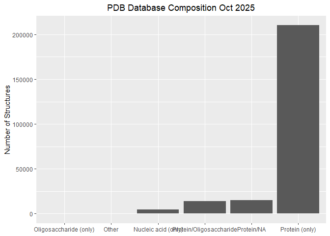
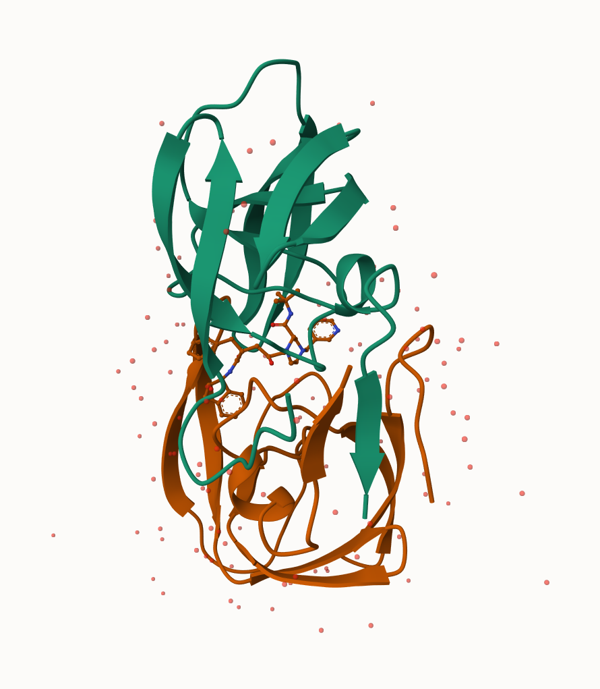
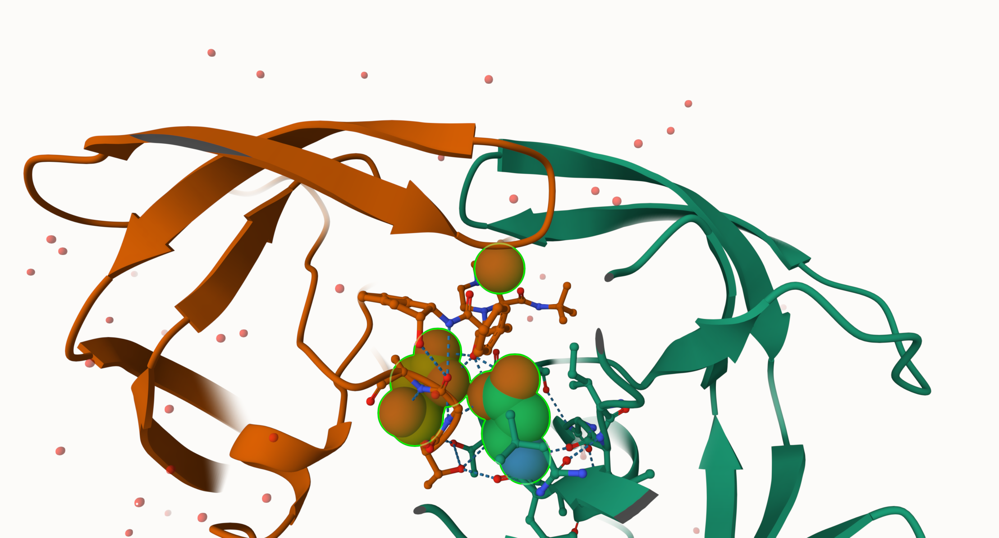
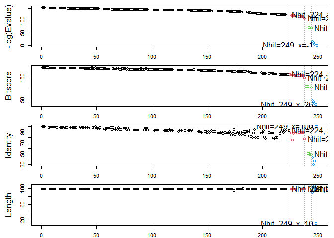
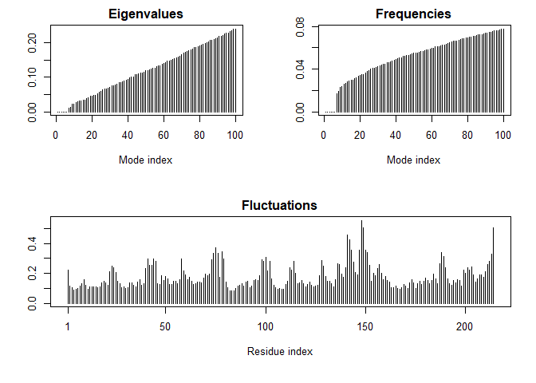

# Class 9: Structural Bioinformatics pt. 1
Shazreh Hassan (PID: A13743949)

The main repository for biomolecular structure data is the Protein Data
Bank (PDB) https://www.rcsb.org

Let’s have a quick look at the composition of this database:

``` r
stats <- read.csv("Data Export Summary.csv")
head(stats)
```

               Molecular.Type   X.ray     EM    NMR Integrative Multiple.methods
    1          Protein (only) 176,378 20,438 12,709         342              221
    2 Protein/Oligosaccharide  10,284  3,396     34           8               11
    3              Protein/NA   9,007  5,931    287          24                7
    4     Nucleic acid (only)   3,077    200  1,554           2               15
    5                   Other     174     13     33           3                0
    6  Oligosaccharide (only)      11      0      6           0                1
      Neutron Other   Total
    1      83    32 210,203
    2       1     0  13,734
    3       0     0  15,256
    4       3     1   4,852
    5       0     0     223
    6       0     4      22

> Q1: What percentage of structures in the PDB are solved by X-Ray and
> Electron Microscopy.

``` r
#first convert characters to integers
as.numeric(sub(",", "", stats$X.ray))
```

    [1] 176378  10284   9007   3077    174     11

This is annoying let’s try a different import function from the
**readr** package.

``` r
library(readr)

stats <- read_csv("Data Export Summary.csv")
```

    Rows: 6 Columns: 9
    ── Column specification ────────────────────────────────────────────────────────
    Delimiter: ","
    chr (1): Molecular Type
    dbl (4): Integrative, Multiple methods, Neutron, Other
    num (4): X-ray, EM, NMR, Total

    ℹ Use `spec()` to retrieve the full column specification for this data.
    ℹ Specify the column types or set `show_col_types = FALSE` to quiet this message.

If you don’t want to load the whole package, you can use
`readr::read_csv()`

``` r
#percent X-ray
n.total <- sum(stats$Total)
n.xray <- sum(stats$`X-ray`)

round(n.xray/n.total * 100, 2)
```

    [1] 81.43

``` r
#percent EM
n.EM <- sum(stats$EM)

round(n.EM/n.total * 100, 2)
```

    [1] 12.27

> Q2: What proportion of structures in the PDB are protein only?

``` r
n.protein <- stats[1, "Total"]

round(n.protein/n.total *100, 2)
```

      Total
    1 86.05

> Q3. Make a bar plot overview of Molecular type composition using
> ggplot

``` r
library(ggplot2)

ggplot(stats)+
  aes(reorder(`Molecular Type`, Total), Total)+
  geom_col()+
  labs(title="PDB Database Composition Oct 2025") +
  theme(plot.title = element_text(hjust=0.5)) +
  xlab(NULL) + 
  ylab("Number of Structures")
```



## visualizing structure data

The Mol\* viewer is embedded in many bioninformatics websites. The
homepage is https://molstar.org

I can insert any figure or image file using markdown format





## Bio3D package for structural bioinformatics

We can use the bio3d package to read and analyze biomolecular data in R:

``` r
library(bio3d)
```

    Warning: package 'bio3d' was built under R version 4.5.2

``` r
hiv <-  read.pdb("1hsg")
```

      Note: Accessing on-line PDB file

``` r
hiv
```


     Call:  read.pdb(file = "1hsg")

       Total Models#: 1
         Total Atoms#: 1686,  XYZs#: 5058  Chains#: 2  (values: A B)

         Protein Atoms#: 1514  (residues/Calpha atoms#: 198)
         Nucleic acid Atoms#: 0  (residues/phosphate atoms#: 0)

         Non-protein/nucleic Atoms#: 172  (residues: 128)
         Non-protein/nucleic resid values: [ HOH (127), MK1 (1) ]

       Protein sequence:
          PQITLWQRPLVTIKIGGQLKEALLDTGADDTVLEEMSLPGRWKPKMIGGIGGFIKVRQYD
          QILIEICGHKAIGTVLVGPTPVNIIGRNLLTQIGCTLNFPQITLWQRPLVTIKIGGQLKE
          ALLDTGADDTVLEEMSLPGRWKPKMIGGIGGFIKVRQYDQILIEICGHKAIGTVLVGPTP
          VNIIGRNLLTQIGCTLNF

    + attr: atom, xyz, seqres, helix, sheet,
            calpha, remark, call

``` r
head(hiv$atom)
```

      type eleno elety  alt resid chain resno insert      x      y     z o     b
    1 ATOM     1     N <NA>   PRO     A     1   <NA> 29.361 39.686 5.862 1 38.10
    2 ATOM     2    CA <NA>   PRO     A     1   <NA> 30.307 38.663 5.319 1 40.62
    3 ATOM     3     C <NA>   PRO     A     1   <NA> 29.760 38.071 4.022 1 42.64
    4 ATOM     4     O <NA>   PRO     A     1   <NA> 28.600 38.302 3.676 1 43.40
    5 ATOM     5    CB <NA>   PRO     A     1   <NA> 30.508 37.541 6.342 1 37.87
    6 ATOM     6    CG <NA>   PRO     A     1   <NA> 29.296 37.591 7.162 1 38.40
      segid elesy charge
    1  <NA>     N   <NA>
    2  <NA>     C   <NA>
    3  <NA>     C   <NA>
    4  <NA>     O   <NA>
    5  <NA>     C   <NA>
    6  <NA>     C   <NA>

Let’s get the sequence:

``` r
pdbseq(hiv)
```

      1   2   3   4   5   6   7   8   9  10  11  12  13  14  15  16  17  18  19  20 
    "P" "Q" "I" "T" "L" "W" "Q" "R" "P" "L" "V" "T" "I" "K" "I" "G" "G" "Q" "L" "K" 
     21  22  23  24  25  26  27  28  29  30  31  32  33  34  35  36  37  38  39  40 
    "E" "A" "L" "L" "D" "T" "G" "A" "D" "D" "T" "V" "L" "E" "E" "M" "S" "L" "P" "G" 
     41  42  43  44  45  46  47  48  49  50  51  52  53  54  55  56  57  58  59  60 
    "R" "W" "K" "P" "K" "M" "I" "G" "G" "I" "G" "G" "F" "I" "K" "V" "R" "Q" "Y" "D" 
     61  62  63  64  65  66  67  68  69  70  71  72  73  74  75  76  77  78  79  80 
    "Q" "I" "L" "I" "E" "I" "C" "G" "H" "K" "A" "I" "G" "T" "V" "L" "V" "G" "P" "T" 
     81  82  83  84  85  86  87  88  89  90  91  92  93  94  95  96  97  98  99   1 
    "P" "V" "N" "I" "I" "G" "R" "N" "L" "L" "T" "Q" "I" "G" "C" "T" "L" "N" "F" "P" 
      2   3   4   5   6   7   8   9  10  11  12  13  14  15  16  17  18  19  20  21 
    "Q" "I" "T" "L" "W" "Q" "R" "P" "L" "V" "T" "I" "K" "I" "G" "G" "Q" "L" "K" "E" 
     22  23  24  25  26  27  28  29  30  31  32  33  34  35  36  37  38  39  40  41 
    "A" "L" "L" "D" "T" "G" "A" "D" "D" "T" "V" "L" "E" "E" "M" "S" "L" "P" "G" "R" 
     42  43  44  45  46  47  48  49  50  51  52  53  54  55  56  57  58  59  60  61 
    "W" "K" "P" "K" "M" "I" "G" "G" "I" "G" "G" "F" "I" "K" "V" "R" "Q" "Y" "D" "Q" 
     62  63  64  65  66  67  68  69  70  71  72  73  74  75  76  77  78  79  80  81 
    "I" "L" "I" "E" "I" "C" "G" "H" "K" "A" "I" "G" "T" "V" "L" "V" "G" "P" "T" "P" 
     82  83  84  85  86  87  88  89  90  91  92  93  94  95  96  97  98  99 
    "V" "N" "I" "I" "G" "R" "N" "L" "L" "T" "Q" "I" "G" "C" "T" "L" "N" "F" 

Let’s trim to Chain A and get just its sequence:

``` r
chainA <- trim.pdb(hiv, chain="A")
chainA.seq <-  pdbseq(chainA)
```

Let’s blast:

``` r
blast <-  blast.pdb(chainA.seq)
```

     Searching ... please wait (updates every 5 seconds) RID = K6UBDBF3014 
     ..
     Reporting 249 hits

``` r
head(blast$hit.tbl)
```

            queryid subjectids identity alignmentlength mismatches gapopens q.start
    1 Query_4000933     1W5V_A   100.00              99          0        0       1
    2 Query_4000933     2FDE_A   100.00              99          0        0       1
    3 Query_4000933     1AJV_A   100.00              99          0        0       1
    4 Query_4000933     2R38_A    98.99              99          1        0       1
    5 Query_4000933     2R3T_A    98.99              99          1        0       1
    6 Query_4000933     1HXB_A    98.99              99          1        0       1
      q.end s.start s.end   evalue bitscore positives mlog.evalue pdb.id    acc
    1    99      12   110 1.40e-67      199       100    153.9367 1W5V_A 1W5V_A
    2    99       2   100 1.73e-67      198       100    153.7251 2FDE_A 2FDE_A
    3    99       1    99 2.02e-67      198       100    153.5701 1AJV_A 1AJV_A
    4    99       1    99 2.55e-67      198       100    153.3371 2R38_A 2R38_A
    5    99       1    99 2.55e-67      198       100    153.3371 2R3T_A 2R3T_A
    6    99       1    99 2.55e-67      198       100    153.3371 1HXB_A 1HXB_A

Plot a quick overview of blast results

``` r
hits <-  plot(blast)
```

      * Possible cutoff values:    123 110 69 -2 
                Yielding Nhits:    224 238 244 249 

      * Chosen cutoff value of:    69 
                Yielding Nhits:    244 



``` r
#just the accession numbers of the hits we got
hits$pdb.id
```

      [1] "1W5V_A" "2FDE_A" "1AJV_A" "2R38_A" "2R3T_A" "1HXB_A" "1BV9_A" "1AAQ_A"
      [9] "1AXA_A" "1HVS_A" "1ZP8_A" "2QHC_A" "1A8G_A" "2O4L_A" "5COK_A" "1TCX_A"
     [17] "2Z54_A" "1D4S_A" "1BV7_A" "1BWA_A" "1A9M_A" "2FLE_A" "1ODY_A" "1GNN_A"
     [25] "1GNM_A" "5YRS_B" "1HEF_E" "1ODX_A" "4QGI_A" "1BVE_A" "2AZ8_A" "1A30_A"
     [33] "6DH6_A" "6DH0_A" "2I4D_A" "6OOS_A" "1RL8_A" "5YRS_A" "1ZSF_A" "2Q64_A"
     [41] "6DH3_A" "2NPH_A" "2Q63_A" "1LZQ_A" "1FB7_A" "1G6L_A" "1HIV_A" "6OOU_A"
     [49] "1HVC_A" "2I4V_A" "2AZ9_A" "6OOT_A" "2P3B_B" "5KAO_A" "2WL0_A" "6OPT_A"
     [57] "1IZI_A" "1MRX_A" "2PYM_A" "2PYN_A" "1DMP_A" "4K4P_A" "1LV1_A" "1AID_A"
     [65] "1LV1_A" "1ZBG_A" "3TKG_A" "1HVC_A" "5YOK_A" "1G6L_A" "1FGC_C" "3K4V_A"
     [73] "3KT5_A" "3KT5_A" "4QLH_A" "4QLH_A" "2F3K_A" "4Q5M_A" "2AOC_A" "3B80_A"
     [81] "3VF5_A" "2AVQ_A" "1DW6_C" "1KZK_A" "2HS1_A" "1K6C_A" "1MTB_A" "4Q1X_A"
     [89] "4Q1W_A" "4Q5M_A" "3D1X_A" "2AVM_A" "3PWM_A" "3KT2_A" "3KT2_A" "1SDV_A"
     [97] "3JVW_A" "3OY4_A" "1A94_A" "2HS2_A" "4EJ8_A" "2FGU_A" "2AVV_A" "3JW2_A"
    [105] "3BVA_A" "1FFF_C" "3S43_B" "2NXD_A" "1FG6_C" "1EBK_C" "4Q1Y_A" "3EL4_A"
    [113] "1F7A_A" "1K2B_A" "2FGV_A" "1Z8C_A" "2G69_A" "3EL9_A" "3OXV_A" "1BDR_A"
    [121] "3N3I_A" "3N3I_A" "3OXW_A" "3S43_A" "3EM3_A" "3CYW_A" "5KQX_A" "2B60_A"
    [129] "7DOZ_A" "1K2C_A" "1MT7_A" "3EM4_A" "4QJ9_A" "1BDL_A" "3LZS_A" "5T84_A"
    [137] "4DQB_A" "7DOZ_A" "4QJ2_A" "3LZV_A" "1SGU_A" "2FXE_A" "1BDQ_A" "3U71_A"
    [145] "2R5P_A" "4OBD_A" "7MAS_A" "3IXO_A" "3D3T_A" "5YOJ_A" "3LZU_A" "4NJS_A"
    [153] "3EKP_A" "1B6J_A" "3EKQ_A" "2RKF_A" "1C6X_A" "7MAR_A" "4DQF_A" "1RPI_A"
    [161] "3OU1_B" "3PJ6_A" "2P3A_A" "6OGQ_A" "3OQ7_A" "5KR1_A" "3OQD_A" "4RVI_A"
    [169] "3OQA_A" "1B6K_A" "3OUD_B" "6MK9_A" "3SO9_A" "1Q9P_A" "6I45_A" "7SEP_A"
    [177] "4NJT_A" "3BXR_A" "4YOA_A" "4DQC_A" "2FDD_A" "2RKG_A" "4DQH_A" "2P3C_A"
    [185] "4EP2_A" "4EP2_A" "4EQ0_A" "4NPT_A" "6OPU_A" "4NPU_A" "3U7S_A" "3HAW_A"
    [193] "2AZB_A" "3TTP_A" "3HBO_A" "3GGU_A" "7N6T_A" "6OPV_A" "4EQ0_A" "6OPX_A"
    [201] "2O4N_A" "5T2E_A" "3UCB_A" "3KA2_A" "3FSM_A" "6OPW_A" "2AZC_A" "3FSM_A"
    [209] "3HLO_A" "2P3D_A" "3T3C_A" "7MYP_A" "6O54_X" "6OPY_A" "4Z4X_A" "6OPZ_A"
    [217] "2JE4_A" "1DAZ_C" "7MAP_A" "7MAQ_A" "1K1U_A" "2B7Z_A" "3MWS_A" "1K1T_A"
    [225] "8DCH_A" "3I2L_A" "6P9A_A" "2FXD_A" "2J9J_A" "3DCK_A" "2J9J_B" "3NXE_A"
    [233] "2O40_A" "2O40_A" "3NXE_A" "3KA2_A" "3HLO_A" "5B18_A" "1SIP_A" "2SAM_A"
    [241] "1AZ5_A" "1SIV_A" "1HII_A" "1IVP_A"

## Prediction of functional motions

We can run a Normal Mode Analysis (NMA) to predict large scale
motions/flexibility/dynamics of any biomolecule that we can read into R.

Let’s look at ADK and chain A only:

``` r
adk <- read.pdb("1ake")
```

      Note: Accessing on-line PDB file
       PDB has ALT records, taking A only, rm.alt=TRUE

``` r
adk_A <-  trim.pdb(adk, chain="A")
adk_A
```


     Call:  trim.pdb(pdb = adk, chain = "A")

       Total Models#: 1
         Total Atoms#: 1954,  XYZs#: 5862  Chains#: 1  (values: A)

         Protein Atoms#: 1656  (residues/Calpha atoms#: 214)
         Nucleic acid Atoms#: 0  (residues/phosphate atoms#: 0)

         Non-protein/nucleic Atoms#: 298  (residues: 242)
         Non-protein/nucleic resid values: [ AP5 (1), HOH (241) ]

       Protein sequence:
          MRIILLGAPGAGKGTQAQFIMEKYGIPQISTGDMLRAAVKSGSELGKQAKDIMDAGKLVT
          DELVIALVKERIAQEDCRNGFLLDGFPRTIPQADAMKEAGINVDYVLEFDVPDELIVDRI
          VGRRVHAPSGRVYHVKFNPPKVEGKDDVTGEELTTRKDDQEETVRKRLVEYHQMTAPLIG
          YYSKEAEAGNTKYAKVDGTKPVAEVRADLEKILG

    + attr: atom, helix, sheet, seqres, xyz,
            calpha, call

``` r
m <- nma(adk_A)
```

     Building Hessian...        Done in 0.03 seconds.
     Diagonalizing Hessian...   Done in 0.24 seconds.

``` r
plot(m)
```



Let’s write out a “trajectory” of predicted motion

``` r
#also  saving trajectory as a file
mktrj(m, file="adk_nma.pdb")
```

## Play with 3D viewing in R

We can use the new **bio3dview** package, which is not yet on CRAN, to
render interactive 3D views in Rand HTML quarto output reports.

To install from Github, we can use the **pak** package.
