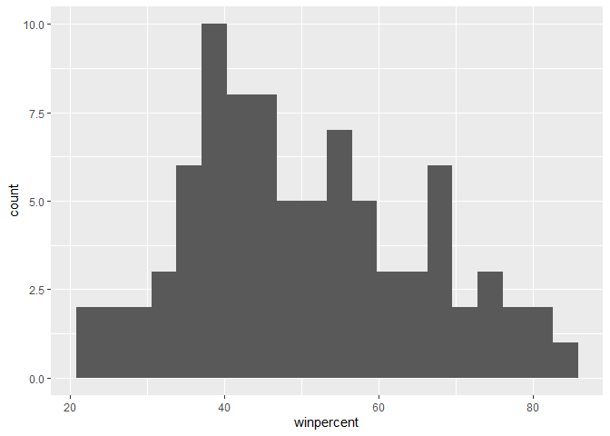
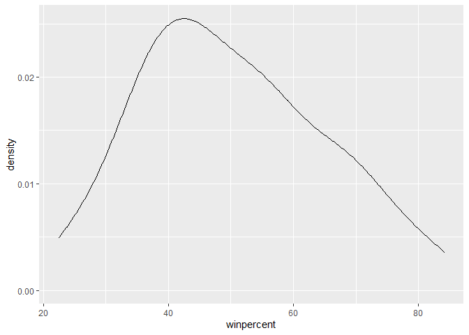
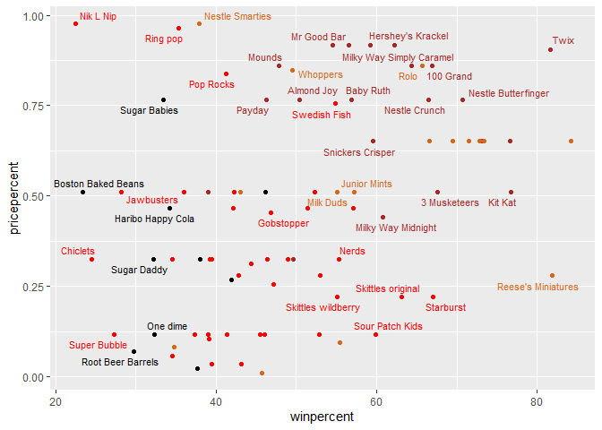
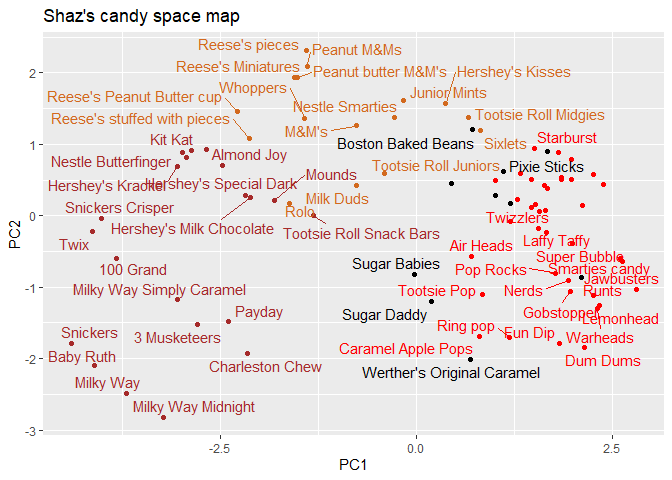
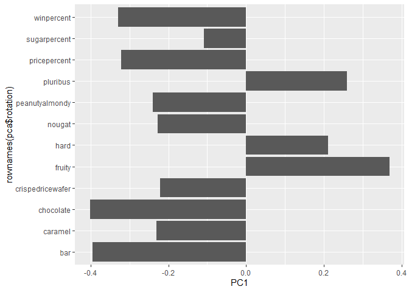

# Class10: Halloween Mini-Project
Shazreh Hassan (PID: A13743949)

## Importing candy data

``` r
candy_file <- read.csv("https://raw.githubusercontent.com/fivethirtyeight/data/master/candy-power-ranking/candy-data.csv")

candy <- read.csv("https://raw.githubusercontent.com/fivethirtyeight/data/master/candy-power-ranking/candy-data.csv", row.names=1)
head(candy)
```

                 chocolate fruity caramel peanutyalmondy nougat crispedricewafer
    100 Grand            1      0       1              0      0                1
    3 Musketeers         1      0       0              0      1                0
    One dime             0      0       0              0      0                0
    One quarter          0      0       0              0      0                0
    Air Heads            0      1       0              0      0                0
    Almond Joy           1      0       0              1      0                0
                 hard bar pluribus sugarpercent pricepercent winpercent
    100 Grand       0   1        0        0.732        0.860   66.97173
    3 Musketeers    0   1        0        0.604        0.511   67.60294
    One dime        0   0        0        0.011        0.116   32.26109
    One quarter     0   0        0        0.011        0.511   46.11650
    Air Heads       0   0        0        0.906        0.511   52.34146
    Almond Joy      0   1        0        0.465        0.767   50.34755

``` r
flextable:: flextable(head(candy))
```


> Q1. How many different candy types are in this dataset?

``` r
library(dplyr)
nrow(candy)
```

    [1] 85

> Q2. How many fruity candy types are in the dataset?

``` r
sum(candy$fruity)
```

    [1] 38

## What is your favorite candy?

> Q3. What is your favorite candy in the dataset and what is it’s
> winpercent value?

``` r
#favorite candy: Junior Mints

candy["Junior Mints", ]$winpercent
```

    [1] 57.21925

> Q4. What is the winpercent value for “Kit Kat”?

``` r
candy["Kit Kat", ]$winpercent
```

    [1] 76.7686

> Q5. What is the winpercent value for “Tootsie Roll Snack Bars”?

``` r
candy["Tootsie Roll Snack Bars", ]$winpercent
```

    [1] 49.6535

``` r
library("skimr")
skim(candy)
```

|                                                  |       |
|:-------------------------------------------------|:------|
| Name                                             | candy |
| Number of rows                                   | 85    |
| Number of columns                                | 12    |
| \_\_\_\_\_\_\_\_\_\_\_\_\_\_\_\_\_\_\_\_\_\_\_   |       |
| Column type frequency:                           |       |
| numeric                                          | 12    |
| \_\_\_\_\_\_\_\_\_\_\_\_\_\_\_\_\_\_\_\_\_\_\_\_ |       |
| Group variables                                  | None  |

Data summary

**Variable type: numeric**

| skim_variable | n_missing | complete_rate | mean | sd | p0 | p25 | p50 | p75 | p100 | hist |
|:---|---:|---:|---:|---:|---:|---:|---:|---:|---:|:---|
| chocolate | 0 | 1 | 0.44 | 0.50 | 0.00 | 0.00 | 0.00 | 1.00 | 1.00 | ▇▁▁▁▆ |
| fruity | 0 | 1 | 0.45 | 0.50 | 0.00 | 0.00 | 0.00 | 1.00 | 1.00 | ▇▁▁▁▆ |
| caramel | 0 | 1 | 0.16 | 0.37 | 0.00 | 0.00 | 0.00 | 0.00 | 1.00 | ▇▁▁▁▂ |
| peanutyalmondy | 0 | 1 | 0.16 | 0.37 | 0.00 | 0.00 | 0.00 | 0.00 | 1.00 | ▇▁▁▁▂ |
| nougat | 0 | 1 | 0.08 | 0.28 | 0.00 | 0.00 | 0.00 | 0.00 | 1.00 | ▇▁▁▁▁ |
| crispedricewafer | 0 | 1 | 0.08 | 0.28 | 0.00 | 0.00 | 0.00 | 0.00 | 1.00 | ▇▁▁▁▁ |
| hard | 0 | 1 | 0.18 | 0.38 | 0.00 | 0.00 | 0.00 | 0.00 | 1.00 | ▇▁▁▁▂ |
| bar | 0 | 1 | 0.25 | 0.43 | 0.00 | 0.00 | 0.00 | 0.00 | 1.00 | ▇▁▁▁▂ |
| pluribus | 0 | 1 | 0.52 | 0.50 | 0.00 | 0.00 | 1.00 | 1.00 | 1.00 | ▇▁▁▁▇ |
| sugarpercent | 0 | 1 | 0.48 | 0.28 | 0.01 | 0.22 | 0.47 | 0.73 | 0.99 | ▇▇▇▇▆ |
| pricepercent | 0 | 1 | 0.47 | 0.29 | 0.01 | 0.26 | 0.47 | 0.65 | 0.98 | ▇▇▇▇▆ |
| winpercent | 0 | 1 | 50.32 | 14.71 | 22.45 | 39.14 | 47.83 | 59.86 | 84.18 | ▃▇▆▅▂ |

> Q6. Is there any variable/column that looks to be on a different scale
> to the majority of the other columns in the dataset?

winpercent looks like it is on a 1-100 scale while the others are 0-1

> Q7. What do you think a zero and one represent for the
> candy\$chocolate column?

Zero means the candy does not have chocolate, and 1 means it does.

> Q8. Plot a histogram of winpercent values

``` r
library(ggplot2)

ggplot(candy)+
  aes(winpercent)+
  geom_histogram(bins=20)
```



> Q9. Is the distribution of winpercent values symmetrical?

``` r
#density plot

ggplot(candy)+
  aes(winpercent)+
  geom_density()
```



No, it looks skewed to the left of the 50% mark.

> Q10. Is the center of the distribution above or below 50%?

``` r
summary(candy$winpercent)
```

       Min. 1st Qu.  Median    Mean 3rd Qu.    Max. 
      22.45   39.14   47.83   50.32   59.86   84.18 

The center of the distribution is below 50%.

> Q11. On average is chocolate candy higher or lower ranked than fruit
> candy?

``` r
# 1. find all chocolate candy in the dataset
ind.choc <- candy$chocolate==1
choc.candy <- candy[ind.choc,]

# 2. extract their winpercent values
choc.win <- choc.candy$winpercent

# 3. find the mean of these values
choc.mean <- mean(choc.win)

# 4-6. do the same for fruity candy
fruit.win <- candy[candy$fruity==1,]$winpercent
fruit.mean <- mean(fruit.win)

# 7. which mean value is higher?
choc.mean
```

    [1] 60.92153

``` r
fruit.mean
```

    [1] 44.11974

Chocolate is higher ranked

> Q12. Is this difference statistically significant?

``` r
t.test(choc.win, fruit.win)
```


        Welch Two Sample t-test

    data:  choc.win and fruit.win
    t = 6.2582, df = 68.882, p-value = 2.871e-08
    alternative hypothesis: true difference in means is not equal to 0
    95 percent confidence interval:
     11.44563 22.15795
    sample estimates:
    mean of x mean of y 
     60.92153  44.11974 

Yes, this difference is statistically significant.

## Overall candy rankings

> Q13. What are the five least liked candy types in this set?

``` r
ord.ind <- order(candy$winpercent)
head(candy[ord.ind,], 5)
```

                       chocolate fruity caramel peanutyalmondy nougat
    Nik L Nip                  0      1       0              0      0
    Boston Baked Beans         0      0       0              1      0
    Chiclets                   0      1       0              0      0
    Super Bubble               0      1       0              0      0
    Jawbusters                 0      1       0              0      0
                       crispedricewafer hard bar pluribus sugarpercent pricepercent
    Nik L Nip                         0    0   0        1        0.197        0.976
    Boston Baked Beans                0    0   0        1        0.313        0.511
    Chiclets                          0    0   0        1        0.046        0.325
    Super Bubble                      0    0   0        0        0.162        0.116
    Jawbusters                        0    1   0        1        0.093        0.511
                       winpercent
    Nik L Nip            22.44534
    Boston Baked Beans   23.41782
    Chiclets             24.52499
    Super Bubble         27.30386
    Jawbusters           28.12744

> Q14. What are the top 5 all time favorite candy types out of this set?

``` r
tail(candy[ord.ind,], 5)
```

                              chocolate fruity caramel peanutyalmondy nougat
    Snickers                          1      0       1              1      1
    Kit Kat                           1      0       0              0      0
    Twix                              1      0       1              0      0
    Reese's Miniatures                1      0       0              1      0
    Reese's Peanut Butter cup         1      0       0              1      0
                              crispedricewafer hard bar pluribus sugarpercent
    Snickers                                 0    0   1        0        0.546
    Kit Kat                                  1    0   1        0        0.313
    Twix                                     1    0   1        0        0.546
    Reese's Miniatures                       0    0   0        0        0.034
    Reese's Peanut Butter cup                0    0   0        0        0.720
                              pricepercent winpercent
    Snickers                         0.651   76.67378
    Kit Kat                          0.511   76.76860
    Twix                             0.906   81.64291
    Reese's Miniatures               0.279   81.86626
    Reese's Peanut Butter cup        0.651   84.18029

> Q15. Make a first barplot of candy ranking based on winpercent values.

``` r
ggplot(candy)+
  aes(winpercent, reorder(rownames(candy),winpercent))+
  geom_col()
```


Add some color

``` r
mycols <- rep("black", nrow(candy))
mycols[candy$chocolate==1] <- "chocolate"
mycols[candy$bar==1] <- "brown"
mycols[candy$fruity==1] <- "red"
  
ggplot(candy)+
  aes(winpercent, reorder(rownames(candy),winpercent))+
  geom_col(fill=mycols)
```


## Winpercent vs Pricepercent

``` r
library(ggrepel)

ggplot(candy)+
  aes(winpercent, pricepercent, label=rownames(candy))+
  geom_point(col=mycols)+
  geom_text_repel(col=mycols, size=3, max.overlaps = 5)
```

    Warning: ggrepel: 45 unlabeled data points (too many overlaps). Consider
    increasing max.overlaps



## Exploring the correlation structure

``` r
cij <- cor(candy)
```

``` r
library(corrplot)
```

    corrplot 0.95 loaded

``` r
corrplot(cij)
```


## Principal component analysis

The main function in base R for this is `prcomp()` and we want to seet
`scale=TRUE` here:

``` r
pca <- prcomp(candy, scale=TRUE)
summary(pca)
```

    Importance of components:
                              PC1    PC2    PC3     PC4    PC5     PC6     PC7
    Standard deviation     2.0788 1.1378 1.1092 1.07533 0.9518 0.81923 0.81530
    Proportion of Variance 0.3601 0.1079 0.1025 0.09636 0.0755 0.05593 0.05539
    Cumulative Proportion  0.3601 0.4680 0.5705 0.66688 0.7424 0.79830 0.85369
                               PC8     PC9    PC10    PC11    PC12
    Standard deviation     0.74530 0.67824 0.62349 0.43974 0.39760
    Proportion of Variance 0.04629 0.03833 0.03239 0.01611 0.01317
    Cumulative Proportion  0.89998 0.93832 0.97071 0.98683 1.00000

Let’s visualize our first main result figure - the PC plot or PC1 vs PC2

``` r
ggplot(pca$x)+
  aes(PC1, PC2, label=rownames(pca$x))+
  geom_point(col=mycols)+
  geom_text_repel(col=mycols)+
  labs(title="Shaz's candy space map")
```

    Warning: ggrepel: 27 unlabeled data points (too many overlaps). Consider
    increasing max.overlaps



Don’t forget about your variable “loadings” - how the original variables
contribute to your new PCs…

``` r
ggplot(pca$rotation)+
  aes(PC1, rownames(pca$rotation))+
  geom_col()
```


