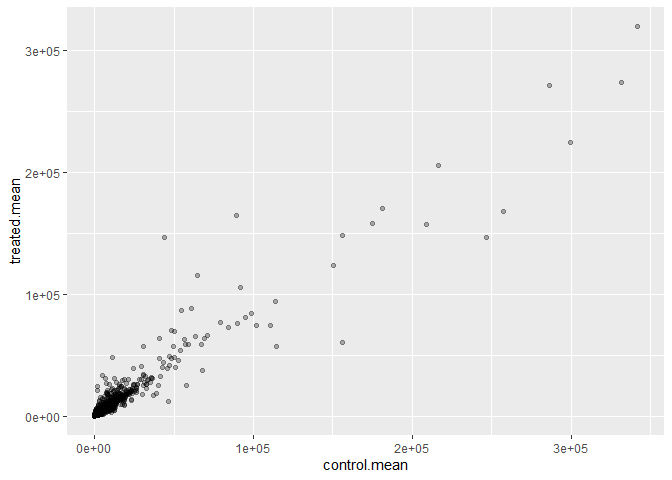
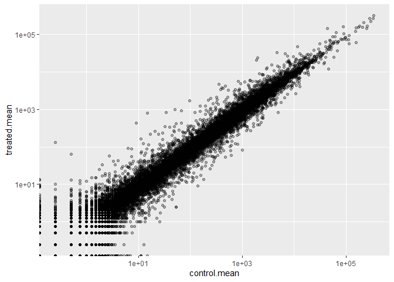
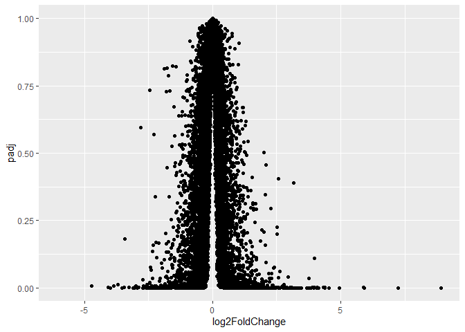
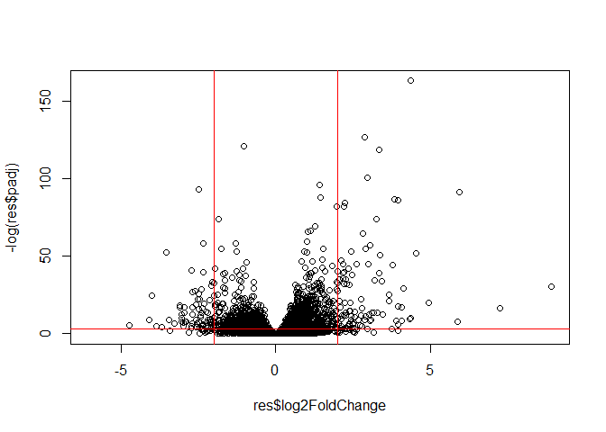
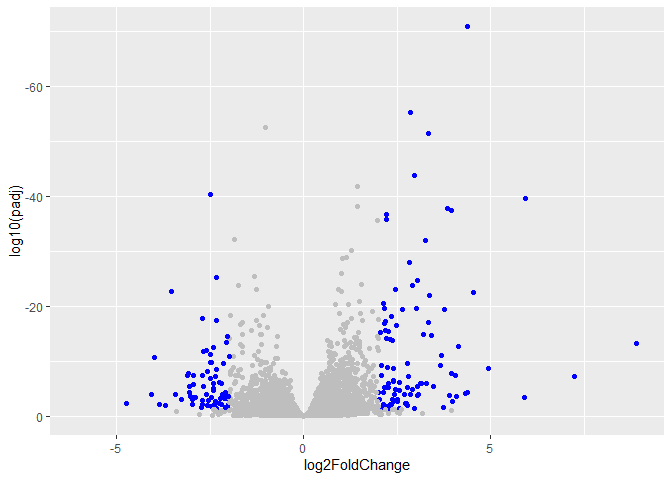

# Class 12
Shazreh Hassan (PID A13743949)

- [Background](#background)
- [Data Import](#data-import)
- [Toy analysis example](#toy-analysis-example)
- [DESeq analysis](#deseq-analysis)
- [Volcano plot](#volcano-plot)
- [A nicer ggplot volcano plot](#a-nicer-ggplot-volcano-plot)
- [Save our results](#save-our-results)
- [Add annotation data](#add-annotation-data)
- [Save my annotated results](#save-my-annotated-results)

## Background

Today we will analyze some RNASeq data from Himes et al. on the effects
of a common steroid (dexamethasone also called “dex”) on airway smooth
muscle cells (ASMs).

For this analysus we need two main inputs

- `countData`: a table of counts per gene (in rows) across experiments
  (in collumns)
- `colData`: **metadata** about the design of the experiments. The rows
  must match the columns in `countData`

## Data Import

``` r
counts <- read.csv("airway_scaledcounts.csv", row.names=1)
metadata <- read.csv("airway_metadata.csv")
```

``` r
head(counts)
```

                    SRR1039508 SRR1039509 SRR1039512 SRR1039513 SRR1039516
    ENSG00000000003        723        486        904        445       1170
    ENSG00000000005          0          0          0          0          0
    ENSG00000000419        467        523        616        371        582
    ENSG00000000457        347        258        364        237        318
    ENSG00000000460         96         81         73         66        118
    ENSG00000000938          0          0          1          0          2
                    SRR1039517 SRR1039520 SRR1039521
    ENSG00000000003       1097        806        604
    ENSG00000000005          0          0          0
    ENSG00000000419        781        417        509
    ENSG00000000457        447        330        324
    ENSG00000000460         94        102         74
    ENSG00000000938          0          0          0

``` r
head(metadata)
```

              id     dex celltype     geo_id
    1 SRR1039508 control   N61311 GSM1275862
    2 SRR1039509 treated   N61311 GSM1275863
    3 SRR1039512 control  N052611 GSM1275866
    4 SRR1039513 treated  N052611 GSM1275867
    5 SRR1039516 control  N080611 GSM1275870
    6 SRR1039517 treated  N080611 GSM1275871

> Q1. How many “genes” are in this dataset?

``` r
nrow(counts)
```

    [1] 38694

> Q2. How many experiments (i.e columns in `counts` or rows in
> `metadata`) are there?

``` r
ncol(counts)
```

    [1] 8

> Q3 (Q2 in lab sheet). How many “control” experiments are there in this
> dataset?

``` r
sum(metadata$dex == "control")
```

    [1] 4

## Toy analysis example

1.  Extract the “control” columns from `counts`
2.  Calculate the mean value for each gene in these “control” columns

3-4. Do the same for the “treated” columns 5. Compare these mean values
for each gene

Step 1.

``` r
control.inds <- metadata$dex == "control"
control.counts <- counts[ , control.inds]
head(control.counts)
```

                    SRR1039508 SRR1039512 SRR1039516 SRR1039520
    ENSG00000000003        723        904       1170        806
    ENSG00000000005          0          0          0          0
    ENSG00000000419        467        616        582        417
    ENSG00000000457        347        364        318        330
    ENSG00000000460         96         73        118        102
    ENSG00000000938          0          1          2          0

Step 2.

``` r
control.mean <- rowMeans(control.counts)
```

Q4:

Step3.

``` r
treated.inds <- metadata$dex == "treated"
treated.counts <- counts[ , treated.inds]
head(treated.counts)
```

                    SRR1039509 SRR1039513 SRR1039517 SRR1039521
    ENSG00000000003        486        445       1097        604
    ENSG00000000005          0          0          0          0
    ENSG00000000419        523        371        781        509
    ENSG00000000457        258        237        447        324
    ENSG00000000460         81         66         94         74
    ENSG00000000938          0          0          0          0

Step 4.

``` r
treated.mean <- rowMeans(treated.counts)
```

For ease of book-keeping, we can store these together in one data frame
called `meancounts`

``` r
meancounts <- data.frame(control.mean, treated.mean)
head(meancounts)
```

                    control.mean treated.mean
    ENSG00000000003       900.75       658.00
    ENSG00000000005         0.00         0.00
    ENSG00000000419       520.50       546.00
    ENSG00000000457       339.75       316.50
    ENSG00000000460        97.25        78.75
    ENSG00000000938         0.75         0.00

Q5: Step 5. Plot these against each other

``` r
library(ggplot2)

ggplot(meancounts)+
  aes(control.mean, treated.mean)+
  geom_point(alpha=0.3)
```



Q6.

``` r
#use log scale for both axes
ggplot(meancounts)+
  aes(control.mean, treated.mean)+
  geom_point(alpha=0.3)+
  scale_x_log10()+
  scale_y_log10()
```

    Warning in scale_x_log10(): log-10 transformation introduced infinite values.

    Warning in scale_y_log10(): log-10 transformation introduced infinite values.



We used “fold-change” as a way to compare - we usually use log2 units
for fold change

``` r
#treated/control
log2(10/10)
```

    [1] 0

``` r
log2(20/10)
```

    [1] 1

``` r
log2(10/20)
```

    [1] -1

``` r
log2(40/10)
```

    [1] 2

``` r
meancounts$log2fc <-  log2(meancounts$treated.mean/meancounts$control.mean)

head(meancounts)
```

                    control.mean treated.mean      log2fc
    ENSG00000000003       900.75       658.00 -0.45303916
    ENSG00000000005         0.00         0.00         NaN
    ENSG00000000419       520.50       546.00  0.06900279
    ENSG00000000457       339.75       316.50 -0.10226805
    ENSG00000000460        97.25        78.75 -0.30441833
    ENSG00000000938         0.75         0.00        -Inf

A common “rule-of-thumb” threshold for calling something “up” regulated
is a log2-fold change of +2 or greater. For “down” regulated the
log2-fold change is -2 or less.

``` r
#filter out the NaNs and -inf values
nonzero.inds <- rowSums(counts) !=0
mycounts <-  meancounts[nonzero.inds,]
```

``` r
#alternate method
zero.inds <- which(meancounts[,1:2]==0, arr.ind=T)[,1]

mygenes <- meancounts[-zero.inds,]
```

> Q7. What is the purpose of the arr.ind argument in the which()
> function call above? Why would we then take the first column of the
> output and need to call the unique() function?

The arr.ind=TRUE allows us to get the row and column indeces where there
are zero counts. We only need the row answer since that represents genes
that have zero counts. The unique() function prevents rows from being
counted twice if there is more than one zero within it.

> Q8. How many genes are “up” regulated at the +2 log2FC threshold?

``` r
sum(mygenes$log2fc >= 2)
```

    [1] 314

> Q9. How many genes are “down” regulated at the -2 log2FC threshold?

``` r
sum(mygenes$log2fc <= -2)
```

    [1] 485

> Q10. Do you trust these results?

I do not trust these numbers until we have seen whether the difference
is statistically significant.

## DESeq analysis

Let’s do this with DESeq2 and put some stats behind these numbers.

``` r
library(DESeq2)
```

    Warning: package 'matrixStats' was built under R version 4.5.2

DESeq wants 3 things for analyis: 1. countData 2. colData 3. design

``` r
dds <- DESeqDataSetFromMatrix(countData = counts,
                       colData = metadata,
                       design = ~dex)
```

    converting counts to integer mode

    Warning in DESeqDataSet(se, design = design, ignoreRank): some variables in
    design formula are characters, converting to factors

The main function in the DESeq package to run analysis is called
`DESeq()`.

``` r
dds <- DESeq(dds)
```

    estimating size factors

    estimating dispersions

    gene-wise dispersion estimates

    mean-dispersion relationship

    final dispersion estimates

    fitting model and testing

``` r
res <-  results(dds)
res
```

    log2 fold change (MLE): dex treated vs control 
    Wald test p-value: dex treated vs control 
    DataFrame with 38694 rows and 6 columns
                     baseMean log2FoldChange     lfcSE      stat    pvalue
                    <numeric>      <numeric> <numeric> <numeric> <numeric>
    ENSG00000000003  747.1942     -0.3507030  0.168246 -2.084470 0.0371175
    ENSG00000000005    0.0000             NA        NA        NA        NA
    ENSG00000000419  520.1342      0.2061078  0.101059  2.039475 0.0414026
    ENSG00000000457  322.6648      0.0245269  0.145145  0.168982 0.8658106
    ENSG00000000460   87.6826     -0.1471420  0.257007 -0.572521 0.5669691
    ...                   ...            ...       ...       ...       ...
    ENSG00000283115  0.000000             NA        NA        NA        NA
    ENSG00000283116  0.000000             NA        NA        NA        NA
    ENSG00000283119  0.000000             NA        NA        NA        NA
    ENSG00000283120  0.974916      -0.668258   1.69456 -0.394354  0.693319
    ENSG00000283123  0.000000             NA        NA        NA        NA
                         padj
                    <numeric>
    ENSG00000000003  0.163035
    ENSG00000000005        NA
    ENSG00000000419  0.176032
    ENSG00000000457  0.961694
    ENSG00000000460  0.815849
    ...                   ...
    ENSG00000283115        NA
    ENSG00000283116        NA
    ENSG00000283119        NA
    ENSG00000283120        NA
    ENSG00000283123        NA

Note: the padj is corrected for multiple testing

## Volcano plot

This is a plot of log2FC vs adjusted p-value

``` r
ggplot(res)+
  aes(log2FoldChange, padj)+
  geom_point()
```

    Warning: Removed 23549 rows containing missing values or values outside the scale range
    (`geom_point()`).



We care about the small p-values, so let’s take the log

``` r
plot(res$log2FoldChange, -log(res$padj))
abline(v=c(-2,2), col="red")
abline(h=-log(0.05), col="red")
```



## A nicer ggplot volcano plot

``` r
mycols <-  rep("gray", nrow(res))

#makes points that have logFC above or below 2 blue
mycols[abs(res$log2FoldChange) > 2] <- "blue"

#make the points that are not significant gray
mycols[res$padj >= 0.05] <- "gray"

ggplot(res)+
  aes(log2FoldChange, log10(padj))+
  geom_point(col=mycols)+
  scale_y_reverse()
```

    Warning: Removed 23549 rows containing missing values or values outside the scale range
    (`geom_point()`).



## Save our results

``` r
write.csv(res, file="myresults.csv")
```

## Add annotation data

We need to add gene symbols, gene names, and other database ids to make
my results useful for further analysis.

``` r
head(res)
```

    log2 fold change (MLE): dex treated vs control 
    Wald test p-value: dex treated vs control 
    DataFrame with 6 rows and 6 columns
                      baseMean log2FoldChange     lfcSE      stat    pvalue
                     <numeric>      <numeric> <numeric> <numeric> <numeric>
    ENSG00000000003 747.194195     -0.3507030  0.168246 -2.084470 0.0371175
    ENSG00000000005   0.000000             NA        NA        NA        NA
    ENSG00000000419 520.134160      0.2061078  0.101059  2.039475 0.0414026
    ENSG00000000457 322.664844      0.0245269  0.145145  0.168982 0.8658106
    ENSG00000000460  87.682625     -0.1471420  0.257007 -0.572521 0.5669691
    ENSG00000000938   0.319167     -1.7322890  3.493601 -0.495846 0.6200029
                         padj
                    <numeric>
    ENSG00000000003  0.163035
    ENSG00000000005        NA
    ENSG00000000419  0.176032
    ENSG00000000457  0.961694
    ENSG00000000460  0.815849
    ENSG00000000938        NA

The ENS… names are ENSEMBLE entries in the `res` object. We can look
these up using the bioconductor package in an automated way

``` r
head(rownames(res))
```

    [1] "ENSG00000000003" "ENSG00000000005" "ENSG00000000419" "ENSG00000000457"
    [5] "ENSG00000000460" "ENSG00000000938"

We can use the `mapIds()` function from bioconductor package

``` r
library("AnnotationDbi")
library("org.Hs.eg.db")
```

Let’s see what database id formats we can translate between

``` r
columns(org.Hs.eg.db)
```

     [1] "ACCNUM"       "ALIAS"        "ENSEMBL"      "ENSEMBLPROT"  "ENSEMBLTRANS"
     [6] "ENTREZID"     "ENZYME"       "EVIDENCE"     "EVIDENCEALL"  "GENENAME"    
    [11] "GENETYPE"     "GO"           "GOALL"        "IPI"          "MAP"         
    [16] "OMIM"         "ONTOLOGY"     "ONTOLOGYALL"  "PATH"         "PFAM"        
    [21] "PMID"         "PROSITE"      "REFSEQ"       "SYMBOL"       "UCSCKG"      
    [26] "UNIPROT"     

``` r
res$symbol <-  mapIds(org.Hs.eg.db,
                      keys=row.names(res),  #our genenames
                      keytype="ENSEMBL",    #format of our genenames
                      column="SYMBOL",      #the new format we want to add
                      multiVals="first")
```

    'select()' returned 1:many mapping between keys and columns

``` r
head(res$symbol)
```

    ENSG00000000003 ENSG00000000005 ENSG00000000419 ENSG00000000457 ENSG00000000460 
           "TSPAN6"          "TNMD"          "DPM1"         "SCYL3"         "FIRRM" 
    ENSG00000000938 
              "FGR" 

Add `GENENAME` and then `ENTREZID`

``` r
#adding genenames
res$genename <-  mapIds(org.Hs.eg.db,
                      keys=row.names(res),  #our genenames
                      keytype="ENSEMBL",    #format of our genenames
                      column="GENENAME")      #the new format we want to add
```

    'select()' returned 1:many mapping between keys and columns

``` r
#adding ENTREZID
res$entrezid <-  mapIds(org.Hs.eg.db,
                      keys=row.names(res),  #our genenames
                      keytype="ENSEMBL",    #format of our genenames
                      column="ENTREZID")      #the new format we want to add
```

    'select()' returned 1:many mapping between keys and columns

``` r
head(res)
```

    log2 fold change (MLE): dex treated vs control 
    Wald test p-value: dex treated vs control 
    DataFrame with 6 rows and 9 columns
                      baseMean log2FoldChange     lfcSE      stat    pvalue
                     <numeric>      <numeric> <numeric> <numeric> <numeric>
    ENSG00000000003 747.194195     -0.3507030  0.168246 -2.084470 0.0371175
    ENSG00000000005   0.000000             NA        NA        NA        NA
    ENSG00000000419 520.134160      0.2061078  0.101059  2.039475 0.0414026
    ENSG00000000457 322.664844      0.0245269  0.145145  0.168982 0.8658106
    ENSG00000000460  87.682625     -0.1471420  0.257007 -0.572521 0.5669691
    ENSG00000000938   0.319167     -1.7322890  3.493601 -0.495846 0.6200029
                         padj      symbol               genename    entrezid
                    <numeric> <character>            <character> <character>
    ENSG00000000003  0.163035      TSPAN6          tetraspanin 6        7105
    ENSG00000000005        NA        TNMD            tenomodulin       64102
    ENSG00000000419  0.176032        DPM1 dolichyl-phosphate m..        8813
    ENSG00000000457  0.961694       SCYL3 SCY1 like pseudokina..       57147
    ENSG00000000460  0.815849       FIRRM FIGNL1 interacting r..       55732
    ENSG00000000938        NA         FGR FGR proto-oncogene, ..        2268

## Save my annotated results

``` r
write.csv(res, file="myresults_annotated.csv")
```

We will use the **gage** function from bioconductor.

``` r
library(gage)
```

``` r
library(gageData)
library(pathview)
```

    ##############################################################################
    Pathview is an open source software package distributed under GNU General
    Public License version 3 (GPLv3). Details of GPLv3 is available at
    http://www.gnu.org/licenses/gpl-3.0.html. Particullary, users are required to
    formally cite the original Pathview paper (not just mention it) in publications
    or products. For details, do citation("pathview") within R.

    The pathview downloads and uses KEGG data. Non-academic uses may require a KEGG
    license agreement (details at http://www.kegg.jp/kegg/legal.html).
    ##############################################################################

What **gage** wants as input is a named vector of importance i.e. a
vector with labeled fold-changes.

``` r
foldchanges = res$log2FoldChange
names(foldchanges) = res$entrez
head(foldchanges)
```

    [1] -0.35070302          NA  0.20610777  0.02452695 -0.14714205 -1.73228897

Run gage analysis:

``` r
data(kegg.sets.hs)
keggres = gage(foldchanges, gsets=kegg.sets.hs)
```

What is in the results:

``` r
attributes(keggres)
```

    $names
    [1] "greater" "less"    "stats"  

``` r
head(keggres$less, 5)
```

                                             p.geomean stat.mean p.val q.val
    hsa00232 Caffeine metabolism                    NA       NaN    NA    NA
    hsa00983 Drug metabolism - other enzymes        NA       NaN    NA    NA
    hsa01100 Metabolic pathways                     NA       NaN    NA    NA
    hsa00230 Purine metabolism                      NA       NaN    NA    NA
    hsa05340 Primary immunodeficiency               NA       NaN    NA    NA
                                             set.size exp1
    hsa00232 Caffeine metabolism                    0   NA
    hsa00983 Drug metabolism - other enzymes        0   NA
    hsa01100 Metabolic pathways                     0   NA
    hsa00230 Purine metabolism                      0   NA
    hsa05340 Primary immunodeficiency               0   NA

Let’s just look at one of these, hsa05310:

``` r
pathview(gene.data=foldchanges, pathway.id="hsa05310")
```

Insert figure for this pathway


