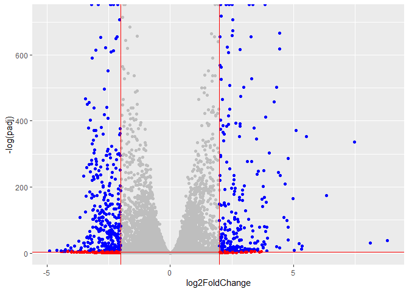

# Class 13: RNASeq mini project
Shazreh Hassan (PID A13743949)

- [Background](#background)
- [Data Import](#data-import)
- [Setup for DESeq](#setup-for-deseq)
- [Run DESeq](#run-deseq)
- [Get results](#get-results)
- [Add annotation](#add-annotation)
- [Visualize results](#visualize-results)
- [Pathway analysis](#pathway-analysis)
  - [KEGG analysis](#kegg-analysis)
  - [Reactome](#reactome)
- [Save results](#save-results)

## Background

Today we will run through a complete RNASeq analysis.

The data for for hands-on session comes from GEO entry: GSE37704, which
is associated with the following publication:

Trapnell C, Hendrickson DG, Sauvageau M, Goff L et al. “Differential
analysis of gene regulation at transcript resolution with RNA-seq”. Nat
Biotechnol 2013 Jan;31(1):46-53. PMID: 23222703

The authors report on differential analysis of lung fibroblasts in
response to loss of the developmental transcription factor HOXA1. Their
results and others indicate that HOXA1 is required for lung fibroblast
and HeLa cell cycle progression.

## Data Import

``` r
counts <- read.csv("GSE37704_featurecounts.csv", row.names=1)

metadata <- read.csv("GSE37704_metadata.csv")
```

Check correspondence of `metadata` and `counts` (i.e. check that columns
in counts match rows in metadata)

``` r
metadata
```

             id     condition
    1 SRR493366 control_sirna
    2 SRR493367 control_sirna
    3 SRR493368 control_sirna
    4 SRR493369      hoxa1_kd
    5 SRR493370      hoxa1_kd
    6 SRR493371      hoxa1_kd

``` r
head(counts)
```

                    length SRR493366 SRR493367 SRR493368 SRR493369 SRR493370
    ENSG00000186092    918         0         0         0         0         0
    ENSG00000279928    718         0         0         0         0         0
    ENSG00000279457   1982        23        28        29        29        28
    ENSG00000278566    939         0         0         0         0         0
    ENSG00000273547    939         0         0         0         0         0
    ENSG00000187634   3214       124       123       205       207       212
                    SRR493371
    ENSG00000186092         0
    ENSG00000279928         0
    ENSG00000279457        46
    ENSG00000278566         0
    ENSG00000273547         0
    ENSG00000187634       258

``` r
colnames(counts)
```

    [1] "length"    "SRR493366" "SRR493367" "SRR493368" "SRR493369" "SRR493370"
    [7] "SRR493371"

``` r
metadata$id
```

    [1] "SRR493366" "SRR493367" "SRR493368" "SRR493369" "SRR493370" "SRR493371"

Fix to remove that first “length” column of `counts`

``` r
counts <- counts[,-1]
```

``` r
#the ! flips the statement, so if the all statement is true we know something wrong happened
test_cols <-  !all(colnames(counts)==metadata$id)
```

``` r
if(test_cols) {
  message("Wow... there is a problem with the metadata counts setup")
}
```

## Setup for DESeq

``` r
library(DESeq2)
```

    Warning: package 'matrixStats' was built under R version 4.5.2

Let’s remove all zero count genes

``` r
zero.inds <- counts != 0

counts <-  counts[zero.inds, ]
counts <- na.omit(counts)

head(counts)
```

                    SRR493366 SRR493367 SRR493368 SRR493369 SRR493370 SRR493371
    ENSG00000279457        23        28        29        29        28        46
    ENSG00000187634       124       123       205       207       212       258
    ENSG00000188976      1637      1831      2383      1226      1326      1504
    ENSG00000187961       120       153       180       236       255       357
    ENSG00000187583        24        48        65        44        48        64
    ENSG00000187642         4         9        16        14        16        16

``` r
tail(counts)
```

                    SRR493366 SRR493367 SRR493368 SRR493369 SRR493370 SRR493371
    ENSG00000278704         1         0         0         0         0         0
    ENSG00000276256        75        69       109        80       116       118
    ENSG00000273748        23        28        26        45        40        54
    ENSG00000278817         3         1         4         1         2         4
    ENSG00000276345        72        73        91        55        67        87
    ENSG00000271254       188       211       222       148       150       161

``` r
dds <- DESeqDataSetFromMatrix(countData = counts,
                              colData = metadata,
                              design = ~condition)
```

    Warning in DESeqDataSet(se, design = design, ignoreRank): some variables in
    design formula are characters, converting to factors

## Run DESeq

``` r
dds <- DESeq(dds)
```

    estimating size factors

    estimating dispersions

    gene-wise dispersion estimates

    mean-dispersion relationship

    final dispersion estimates

    fitting model and testing

## Get results

``` r
res <- results(dds)
```

``` r
head(res)
```

    log2 fold change (MLE): condition hoxa1 kd vs control sirna 
    Wald test p-value: condition hoxa1 kd vs control sirna 
    DataFrame with 6 rows and 6 columns
                     baseMean log2FoldChange     lfcSE       stat      pvalue
                    <numeric>      <numeric> <numeric>  <numeric>   <numeric>
    ENSG00000279457   29.9136      0.1798700 0.3172140   0.567031 5.70693e-01
    ENSG00000187634  183.2296      0.4261240 0.1373950   3.101451 1.92575e-03
    ENSG00000188976 1651.1881     -0.6927187 0.0548747 -12.623655 1.56390e-36
    ENSG00000187961  209.6379      0.7298765 0.1293687   5.641831 1.68251e-08
    ENSG00000187583   47.2551      0.0398092 0.2651916   0.150115 8.80674e-01
    ENSG00000187642   11.9798      0.5408697 0.5086855   1.063269 2.87660e-01
                           padj
                      <numeric>
    ENSG00000279457 6.63919e-01
    ENSG00000187634 4.01743e-03
    ENSG00000188976 1.80126e-35
    ENSG00000187961 5.86867e-08
    ENSG00000187583 9.15681e-01
    ENSG00000187642 3.79679e-01

## Add annotation

``` r
library(AnnotationDbi)
library(org.Hs.eg.db)
```

``` r
columns(org.Hs.eg.db)
```

     [1] "ACCNUM"       "ALIAS"        "ENSEMBL"      "ENSEMBLPROT"  "ENSEMBLTRANS"
     [6] "ENTREZID"     "ENZYME"       "EVIDENCE"     "EVIDENCEALL"  "GENENAME"    
    [11] "GENETYPE"     "GO"           "GOALL"        "IPI"          "MAP"         
    [16] "OMIM"         "ONTOLOGY"     "ONTOLOGYALL"  "PATH"         "PFAM"        
    [21] "PMID"         "PROSITE"      "REFSEQ"       "SYMBOL"       "UCSCKG"      
    [26] "UNIPROT"     

``` r
res$symbol = mapIds(org.Hs.eg.db,
                    keys=row.names(res), 
                    keytype="ENSEMBL",
                    column="SYMBOL",
                    multiVals="first")
```

    'select()' returned 1:many mapping between keys and columns

``` r
res$entrez = mapIds(org.Hs.eg.db,
                    keys=row.names(res),
                    keytype="ENSEMBL",
                    column="ENTREZID",
                    multiVals="first")
```

    'select()' returned 1:many mapping between keys and columns

``` r
res$name =   mapIds(org.Hs.eg.db,
                    keys=row.names(res),
                    keytype="ENSEMBL",
                    column="GENENAME",
                    multiVals="first")
```

    'select()' returned 1:many mapping between keys and columns

``` r
head(res, 10)
```

    log2 fold change (MLE): condition hoxa1 kd vs control sirna 
    Wald test p-value: condition hoxa1 kd vs control sirna 
    DataFrame with 10 rows and 9 columns
                     baseMean log2FoldChange     lfcSE       stat      pvalue
                    <numeric>      <numeric> <numeric>  <numeric>   <numeric>
    ENSG00000279457   29.9136      0.1798700 0.3172140   0.567031 5.70693e-01
    ENSG00000187634  183.2296      0.4261240 0.1373950   3.101451 1.92575e-03
    ENSG00000188976 1651.1881     -0.6927187 0.0548747 -12.623655 1.56390e-36
    ENSG00000187961  209.6379      0.7298765 0.1293687   5.641831 1.68251e-08
    ENSG00000187583   47.2551      0.0398092 0.2651916   0.150115 8.80674e-01
    ENSG00000187642   11.9798      0.5408697 0.5086855   1.063269 2.87660e-01
    ENSG00000188290  108.9221      2.0565985 0.1933757  10.635245 2.04290e-26
    ENSG00000187608  350.7169      0.2571667 0.1010358   2.545304 1.09183e-02
    ENSG00000188157 9128.4394      0.3899093 0.0475653   8.197354 2.45737e-16
    ENSG00000131591  156.4791      0.1967697 0.1426232   1.379647 1.67695e-01
                           padj      symbol      entrez                   name
                      <numeric> <character> <character>            <character>
    ENSG00000279457 6.63919e-01          NA          NA                     NA
    ENSG00000187634 4.01743e-03      SAMD11      148398 sterile alpha motif ..
    ENSG00000188976 1.80126e-35       NOC2L       26155 NOC2 like nucleolar ..
    ENSG00000187961 5.86867e-08      KLHL17      339451 kelch like family me..
    ENSG00000187583 9.15681e-01     PLEKHN1       84069 pleckstrin homology ..
    ENSG00000187642 3.79679e-01       PERM1       84808 PPARGC1 and ESRR ind..
    ENSG00000188290 1.70169e-25        HES4       57801 hes family bHLH tran..
    ENSG00000187608 2.02525e-02       ISG15        9636 ISG15 ubiquitin like..
    ENSG00000188157 1.35547e-15        AGRN      375790                  agrin
    ENSG00000131591 2.39731e-01    C1orf159       54991 chromosome 1 open re..

## Visualize results

``` r
library(ggplot2)
```

``` r
mycols <- rep("gray", nrow(res) )

# Color red the genes with absolute fold change above 2
mycols[ abs(res$log2FoldChange) > 2 ] <- "red"

# Color blue those with adjusted p-value less than 0.01
#  and absolute fold change more than 2
inds <- (res$padj < 0.01) & (abs(res$log2FoldChange) > 2 )
mycols[ inds ] <- "blue"

ggplot(res) + 
  aes(log2FoldChange, -log(padj)) + 
  geom_point(col=mycols) +
  geom_vline(xintercept=c(-2,2), col="red") +
  geom_hline(yintercept= -log(0.05), col="red")
```

    Warning: Removed 277 rows containing missing values or values outside the scale range
    (`geom_point()`).



## Pathway analysis

``` r
library(gage)
```

``` r
library(gageData)

data(kegg.sets.hs)
data(sigmet.idx.hs)
```

``` r
# Focus on signaling and metabolic pathways only
kegg.sets.hs = kegg.sets.hs[sigmet.idx.hs]
```

``` r
foldchanges = res$log2FoldChange
names(foldchanges) = res$entrez
head(foldchanges)
```

           <NA>      148398       26155      339451       84069       84808 
     0.17987004  0.42612404 -0.69271873  0.72987646  0.03980916  0.54086975 

``` r
# Get the results
keggres = gage(foldchanges, gsets=kegg.sets.hs)
```

``` r
attributes(keggres)
```

    $names
    [1] "greater" "less"    "stats"  

``` r
library(pathview)

pathview(gene.data=foldchanges, pathway.id="hsa04110")
```


### KEGG analysis

Compare GO analysis with KEGG analysis

``` r
data(go.sets.hs)
data(go.subs.hs)

# Focus on Biological Process subset of GO
gobpsets <-  go.sets.hs[go.subs.hs$BP]

gobpres <-  gage(foldchanges, gsets=gobpsets, same.dir=TRUE)
```

### Reactome

Some folks really like Reactome online (i.e. their webpage viewer)
rather than the R package of the same name (available from
bioconductor).

To use their website viewer we want to upload our set of gene symbols
for the genes we want to focus on (here those with a p-value below 0.05)

``` r
sig_genes <- res[res$padj <= 0.05 & !is.na(res$padj), "symbol"]
print(paste("Total number of significant genes:", length(sig_genes)))
```

    [1] "Total number of significant genes: 8203"

``` r
write.table(sig_genes, file="significant_genes.txt", row.names=FALSE, col.names=FALSE, quote=FALSE)
```

## Save results

``` r
write.csv(res,file="my_results.csv")
```

``` r
#can only be read in R
save(res, file="my_results.RData")
```
