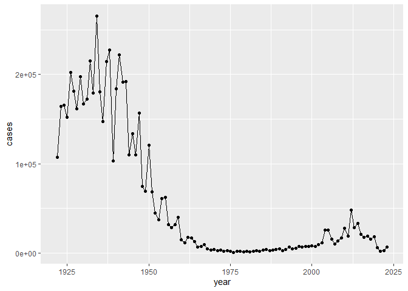
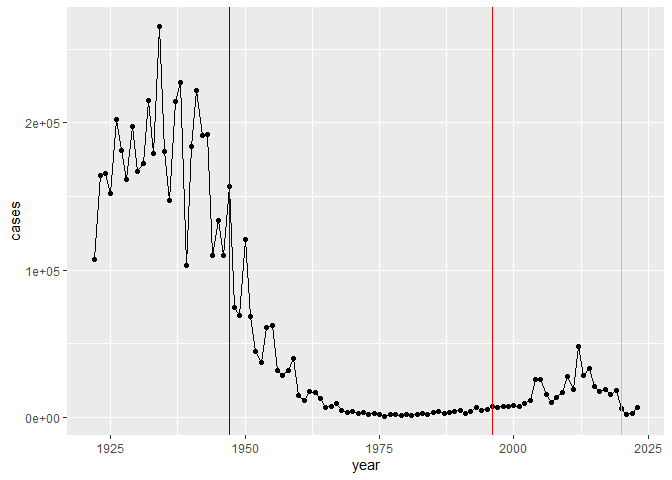
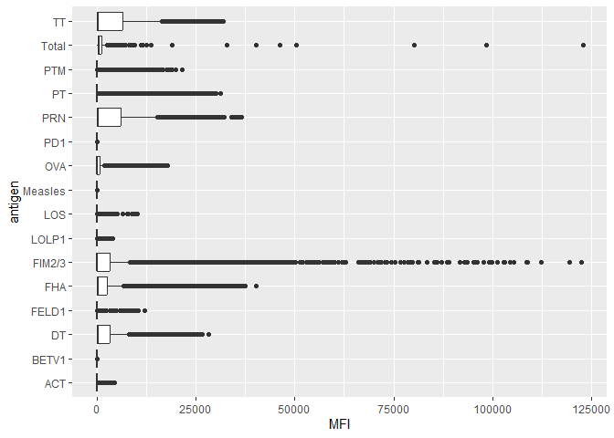
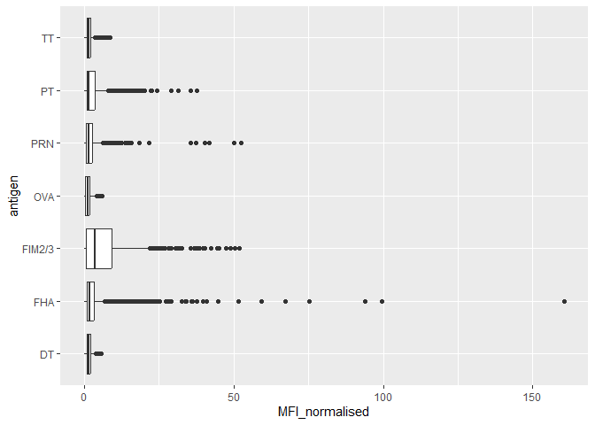
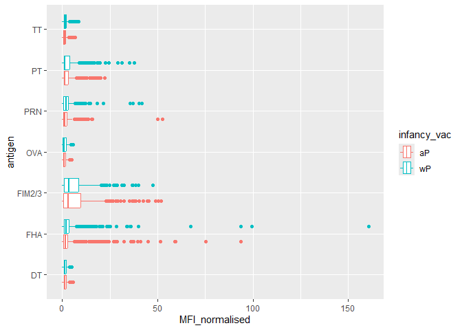
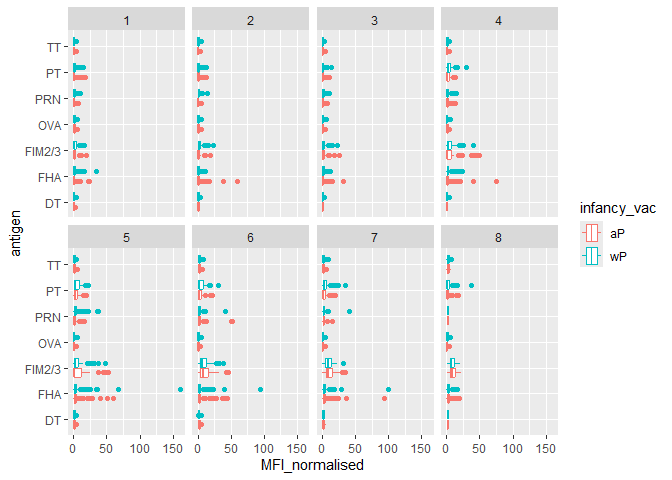
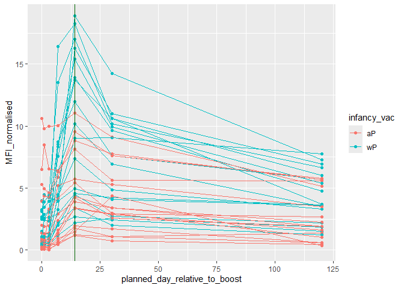

# Class 19: Pertussis Mini Project
Shazreh Hassan (PID A13743949)

- [Background](#background)
- [The CMI-PB project](#the-cmi-pb-project)
- [Focus on IgG](#focus-on-igg)
- [Differences between aP and wP?](#differences-between-ap-and-wp)
- [Time course analysis](#time-course-analysis)
- [Time course of PT (Virulence Factor: Pertussis
  Toxin)](#time-course-of-pt-virulence-factor-pertussis-toxin)
- [System Setup](#system-setup)

## Background

Pertussis AKA whooping cough is a highly infectious lung infection
caused by the bacteria *B. Pertussis*.

The CDC tracks case numbers in the US and makes this data available
online:

> Q1. Make a plot of cases per year with ggplot:

``` r
library(ggplot2)

ggplot(cdc) +
  aes(year, cases) +
  geom_point() +
  geom_line()
```



> Q2. Add some annotation (lines on the plot) for some major milestones
> in our interaction with Pertussis. The original wP deployment in 1947
> and the newer aP vaccine roll-out in 1996.

``` r
ggplot(cdc) +
  aes(year, cases) +
  geom_point() +
  geom_line() +
  geom_vline(xintercept = 1947, col="blue")+
  geom_vline(xintercept = 1996, col="red")+
  geom_vline(xintercept = 2020, col="gray")
```



> Q3. Describe what happened after the introduction of the aP vaccine?
> Do you have a possible explanation for the observed trend?

The number of cases increases after the introduction of the aP vaccine.
This could be because aP vaccine leads to waning immunity and requires a
booster every 10 years, which people may not have been getting.

## The CMI-PB project

The CMI-Pertussis Boost (PB) project focuses on gathering data on this
very topic. What is distinct between aP and wP individuals over time
when they encounter Pertussis again.

They make their data available in JSON format returning API. We can read
this JSON format with the `read_json()` function from the **jsonlite**
package.

``` r
library(jsonlite)
```

    Warning: package 'jsonlite' was built under R version 4.5.2

``` r
subject <- read_json("http://cmi-pb.org/api/v5_1/subject", simplifyVector = TRUE)


head(subject)
```

      subject_id infancy_vac biological_sex              ethnicity  race
    1          1          wP         Female Not Hispanic or Latino White
    2          2          wP         Female Not Hispanic or Latino White
    3          3          wP         Female                Unknown White
    4          4          wP           Male Not Hispanic or Latino Asian
    5          5          wP           Male Not Hispanic or Latino Asian
    6          6          wP         Female Not Hispanic or Latino White
      year_of_birth date_of_boost      dataset
    1    1986-01-01    2016-09-12 2020_dataset
    2    1968-01-01    2019-01-28 2020_dataset
    3    1983-01-01    2016-10-10 2020_dataset
    4    1988-01-01    2016-08-29 2020_dataset
    5    1991-01-01    2016-08-29 2020_dataset
    6    1988-01-01    2016-10-10 2020_dataset

> Q4. How many subjects (or individuals) are in this dataset?

``` r
nrow(subject)
```

    [1] 172

> Q5. How many wP and aP primed subjects are therein the dataset?

``` r
table(subject$infancy_vac)
```


    aP wP 
    87 85 

> Q6. What is the `biological sex` and `race` breakdown of these
> subjects?

``` r
table(subject$race, subject$biological_sex)
```

                                               
                                                Female Male
      American Indian/Alaska Native                  0    1
      Asian                                         32   12
      Black or African American                      2    3
      More Than One Race                            15    4
      Native Hawaiian or Other Pacific Islander      1    1
      Unknown or Not Reported                       14    7
      White                                         48   32

This data is not representative of the US population.

Let’s read more tables from the CMI-PB database API.

``` r
specimen <- read_json("http://cmi-pb.org/api/v5_1/specimen", simplifyVector = TRUE)

ab_titer <- read_json("http://cmi-pb.org/api/v5_1/plasma_ab_titer", simplifyVector = TRUE)
```

``` r
head(specimen)
```

      specimen_id subject_id actual_day_relative_to_boost
    1           1          1                           -3
    2           2          1                            1
    3           3          1                            3
    4           4          1                            7
    5           5          1                           11
    6           6          1                           32
      planned_day_relative_to_boost specimen_type visit
    1                             0         Blood     1
    2                             1         Blood     2
    3                             3         Blood     3
    4                             7         Blood     4
    5                            14         Blood     5
    6                            30         Blood     6

``` r
head(ab_titer)
```

      specimen_id isotype is_antigen_specific antigen        MFI MFI_normalised
    1           1     IgE               FALSE   Total 1110.21154       2.493425
    2           1     IgE               FALSE   Total 2708.91616       2.493425
    3           1     IgG                TRUE      PT   68.56614       3.736992
    4           1     IgG                TRUE     PRN  332.12718       2.602350
    5           1     IgG                TRUE     FHA 1887.12263      34.050956
    6           1     IgE                TRUE     ACT    0.10000       1.000000
       unit lower_limit_of_detection
    1 UG/ML                 2.096133
    2 IU/ML                29.170000
    3 IU/ML                 0.530000
    4 IU/ML                 6.205949
    5 IU/ML                 4.679535
    6 IU/ML                 2.816431

Join (or link, or merge) using the `inner_join()` function from
**dplyr**.

``` r
library(dplyr)
```


    Attaching package: 'dplyr'

    The following objects are masked from 'package:stats':

        filter, lag

    The following objects are masked from 'package:base':

        intersect, setdiff, setequal, union

``` r
meta <- inner_join(subject, specimen)
```

    Joining with `by = join_by(subject_id)`

``` r
head(meta)
```

      subject_id infancy_vac biological_sex              ethnicity  race
    1          1          wP         Female Not Hispanic or Latino White
    2          1          wP         Female Not Hispanic or Latino White
    3          1          wP         Female Not Hispanic or Latino White
    4          1          wP         Female Not Hispanic or Latino White
    5          1          wP         Female Not Hispanic or Latino White
    6          1          wP         Female Not Hispanic or Latino White
      year_of_birth date_of_boost      dataset specimen_id
    1    1986-01-01    2016-09-12 2020_dataset           1
    2    1986-01-01    2016-09-12 2020_dataset           2
    3    1986-01-01    2016-09-12 2020_dataset           3
    4    1986-01-01    2016-09-12 2020_dataset           4
    5    1986-01-01    2016-09-12 2020_dataset           5
    6    1986-01-01    2016-09-12 2020_dataset           6
      actual_day_relative_to_boost planned_day_relative_to_boost specimen_type
    1                           -3                             0         Blood
    2                            1                             1         Blood
    3                            3                             3         Blood
    4                            7                             7         Blood
    5                           11                            14         Blood
    6                           32                            30         Blood
      visit
    1     1
    2     2
    3     3
    4     4
    5     5
    6     6

``` r
ab_data <- inner_join(meta, ab_titer)
```

    Joining with `by = join_by(specimen_id)`

``` r
head(ab_titer)
```

      specimen_id isotype is_antigen_specific antigen        MFI MFI_normalised
    1           1     IgE               FALSE   Total 1110.21154       2.493425
    2           1     IgE               FALSE   Total 2708.91616       2.493425
    3           1     IgG                TRUE      PT   68.56614       3.736992
    4           1     IgG                TRUE     PRN  332.12718       2.602350
    5           1     IgG                TRUE     FHA 1887.12263      34.050956
    6           1     IgE                TRUE     ACT    0.10000       1.000000
       unit lower_limit_of_detection
    1 UG/ML                 2.096133
    2 IU/ML                29.170000
    3 IU/ML                 0.530000
    4 IU/ML                 6.205949
    5 IU/ML                 4.679535
    6 IU/ML                 2.816431

> Q7. How many different Ab isotypes are there?

``` r
unique(ab_data$isotype)
```

    [1] "IgE"  "IgG"  "IgG1" "IgG2" "IgG3" "IgG4"

> Q8. How many different antigens are there in the dataset?

``` r
unique(ab_data$antigen)
```

     [1] "Total"   "PT"      "PRN"     "FHA"     "ACT"     "LOS"     "FELD1"  
     [8] "BETV1"   "LOLP1"   "Measles" "PTM"     "FIM2/3"  "TT"      "DT"     
    [15] "OVA"     "PD1"    

Let’s plot antigen MFI levels across the whole dataset.

``` r
ggplot(ab_data)+
  aes(MFI, antigen)+
  geom_boxplot()
```

    Warning: Removed 1 row containing non-finite outside the scale range
    (`stat_boxplot()`).



## Focus on IgG

IgG is crucial for long-term immunnity and responding to bacterial and
viral infections

``` r
igg <-ab_data |>
  filter(isotype == "IgG")
```

Plot of antigen levels again but only for IgG

``` r
ggplot(igg)+
  aes(MFI_normalised, antigen)+
  geom_boxplot()
```



## Differences between aP and wP?

We can color up by the `infancy_vac` values of “wP” or “aP”

``` r
ggplot(igg)+
  aes(MFI_normalised, antigen, col=infancy_vac)+
  geom_boxplot()
```



We can also “facet” by the “aP” vs “wP” column

``` r
ggplot(igg)+
  aes(MFI_normalised, antigen, col=infancy_vac)+
  geom_boxplot()+
  facet_wrap(~infancy_vac)
```


## Time course analysis

We can use `visit` as a proxy for time here and facet our plots by this
value 1 to 8…

``` r
table(ab_data$visit)
```


       1    2    3    4    5    6    7    8    9   10   11   12 
    8280 8280 8420 8420 8420 8100 7700 2670  770  686  105  105 

``` r
igg |>
  filter(visit %in% 1:8) |>
  ggplot()+
    aes(MFI_normalised, antigen, col=infancy_vac)+
    geom_boxplot()+
    facet_wrap(~visit, nrow=2)
```



## Time course of PT (Virulence Factor: Pertussis Toxin)

``` r
#filtering for one antigen and one dataset

pt <- igg |>
  filter(antigen == "PT") |>
  filter(dataset == "2021_dataset")
```

``` r
ggplot(pt)+
  aes(planned_day_relative_to_boost, MFI_normalised, col=infancy_vac, group = subject_id)+
  geom_point()+
  geom_line()+
  geom_vline(xintercept = 14, col = "darkgreen")
```



## System Setup

``` r
sessionInfo()
```

    R version 4.5.1 (2025-06-13 ucrt)
    Platform: x86_64-w64-mingw32/x64
    Running under: Windows 11 x64 (build 22631)

    Matrix products: default
      LAPACK version 3.12.1

    locale:
    [1] LC_COLLATE=English_United States.utf8 
    [2] LC_CTYPE=English_United States.utf8   
    [3] LC_MONETARY=English_United States.utf8
    [4] LC_NUMERIC=C                          
    [5] LC_TIME=English_United States.utf8    

    time zone: America/Los_Angeles
    tzcode source: internal

    attached base packages:
    [1] stats     graphics  grDevices utils     datasets  methods   base     

    other attached packages:
    [1] dplyr_1.1.4    jsonlite_2.0.0 ggplot2_4.0.0 

    loaded via a namespace (and not attached):
     [1] vctrs_0.6.5        cli_3.6.5          knitr_1.50         rlang_1.1.6       
     [5] xfun_0.54          generics_0.1.4     S7_0.2.0           labeling_0.4.3    
     [9] glue_1.8.0         htmltools_0.5.8.1  scales_1.4.0       rmarkdown_2.30    
    [13] grid_4.5.1         evaluate_1.0.5     tibble_3.3.0       fastmap_1.2.0     
    [17] yaml_2.3.10        lifecycle_1.0.4    compiler_4.5.1     RColorBrewer_1.1-3
    [21] pkgconfig_2.0.3    rstudioapi_0.17.1  farver_2.1.2       digest_0.6.37     
    [25] R6_2.6.1           tidyselect_1.2.1   pillar_1.11.1      magrittr_2.0.4    
    [29] withr_3.0.2        tools_4.5.1        gtable_0.3.6      
