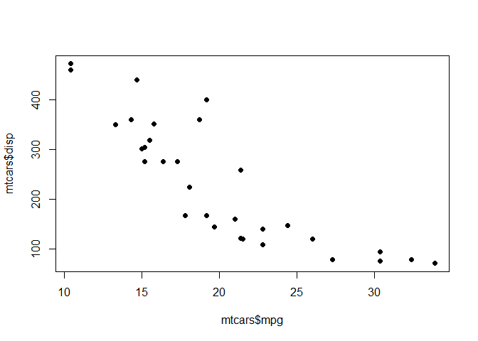
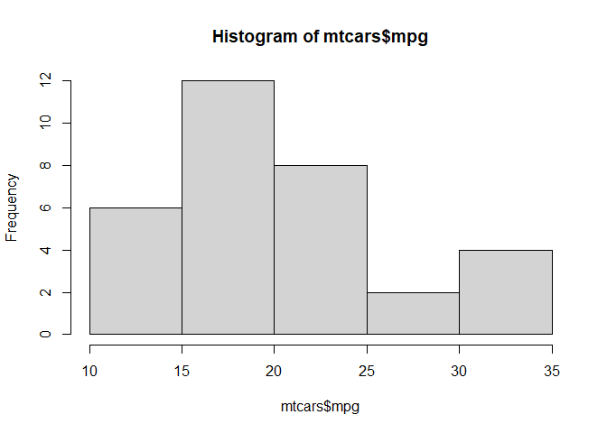
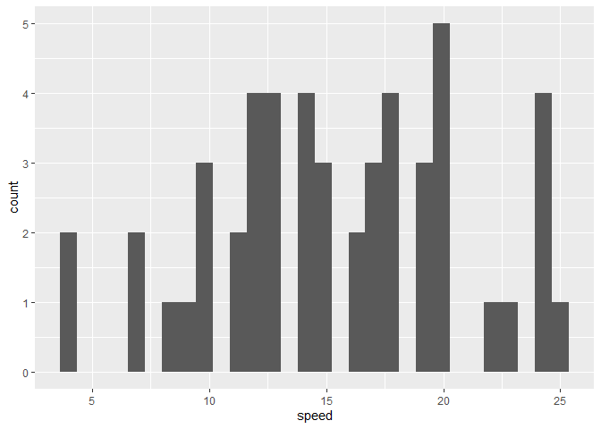
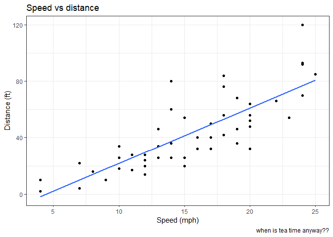
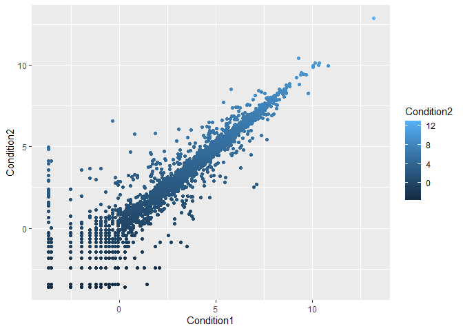
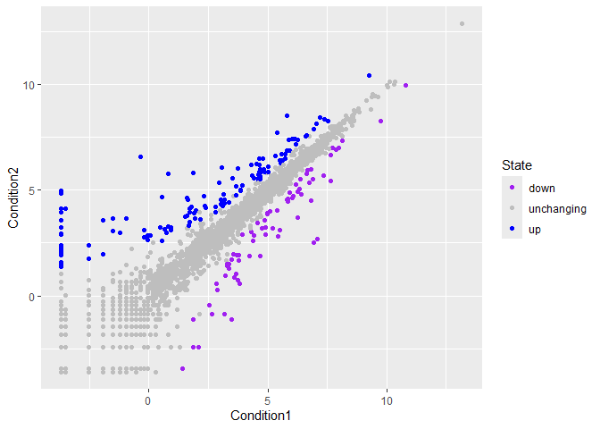
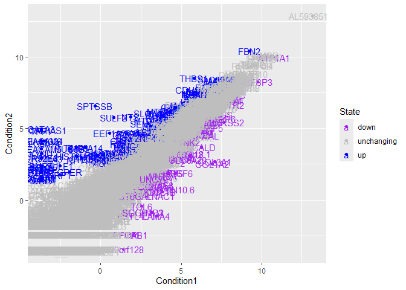
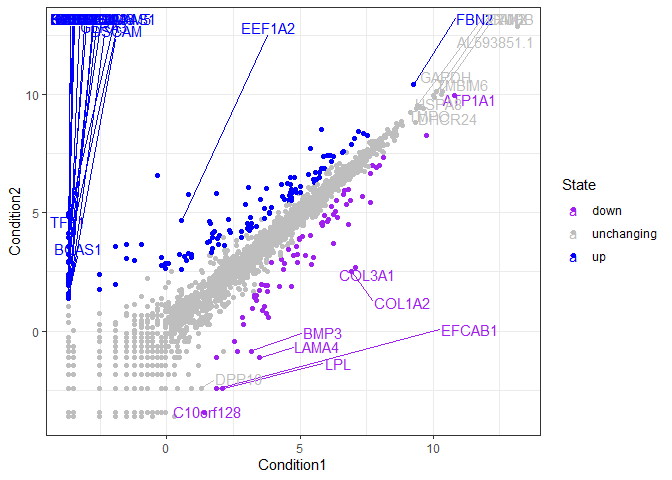
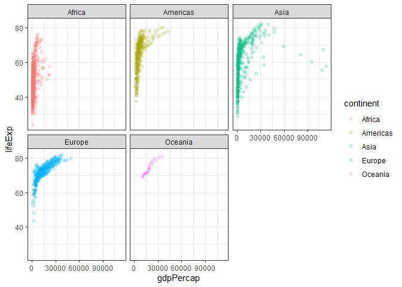

# Class05: data viz with ggplot
Shazreh Hassan (PID: A13743949)

Today we are playing with plotting and graphics in R.

There are lots of ways to make figures in R.

**“base” R graphics** (`plot()`, `hist()`), `boxplot()`, etc.)

Add on packages include **ggplot**

``` r
head(cars)
```

      speed dist
    1     4    2
    2     4   10
    3     7    4
    4     7   22
    5     8   16
    6     9   10

Let’s plot this with “base” R:

``` r
plot(cars)
```


``` r
head(mtcars)
```

                       mpg cyl disp  hp drat    wt  qsec vs am gear carb
    Mazda RX4         21.0   6  160 110 3.90 2.620 16.46  0  1    4    4
    Mazda RX4 Wag     21.0   6  160 110 3.90 2.875 17.02  0  1    4    4
    Datsun 710        22.8   4  108  93 3.85 2.320 18.61  1  1    4    1
    Hornet 4 Drive    21.4   6  258 110 3.08 3.215 19.44  1  0    3    1
    Hornet Sportabout 18.7   8  360 175 3.15 3.440 17.02  0  0    3    2
    Valiant           18.1   6  225 105 2.76 3.460 20.22  1  0    3    1

Let’s plot mpg vs disp:

``` r
#pch of 16 gives filled circles
plot(mtcars$mpg, mtcars$disp, pch=16)
```



Histogram of mpg:

``` r
hist(mtcars$mpg)
```



## GGPLOT

The main function in the ggplot2 is **ggplot()**. The **ggplot2**
package needs to be installed. Any package can be installed with the
function `install.packages()`.

> Do NOT run this in the quarto document, run it in console!

``` r
library(ggplot2)

ggplot(cars)+
  aes(x=speed, y=dist)+
  geom_point()
```


``` r
ggplot(cars)+
  aes(speed)+
  geom_histogram()
```

    `stat_bin()` using `bins = 30`. Pick better value `binwidth`.



Every ggplot needs at least 3 things:

- the **data** (given with `ggplot(cars)`)
- the **aesthetic** mapping (given with `aes()`)
- the **geom** (given by `geom_point()`)

> For simple canned graphs, “base” R is almost always faster

### Adding more layers

Let’s add a line and a title, subtitle, and caption as well as axis
labels:

``` r
ggplot(cars)+
  aes(x=speed, y=dist)+
  geom_point()+ 
  geom_smooth(method="lm", se=FALSE)+
  labs(title = "Speed vs distance", 
       x = "Speed (mph)", 
       y = "Distance (ft)",
       caption = "when is tea time anyway??")+
  theme_bw()
```

    `geom_smooth()` using formula = 'y ~ x'



``` r
url <- "https://bioboot.github.io/bimm143_S20/class-material/up_down_expression.txt"
genes <- read.delim(url)
head(genes)
```

            Gene Condition1 Condition2      State
    1      A4GNT -3.6808610 -3.4401355 unchanging
    2       AAAS  4.5479580  4.3864126 unchanging
    3      AASDH  3.7190695  3.4787276 unchanging
    4       AATF  5.0784720  5.0151916 unchanging
    5       AATK  0.4711421  0.5598642 unchanging
    6 AB015752.4 -3.6808610 -3.5921390 unchanging

> Q1. How many genes are in this wee dataset?

There are 5196 in this dataset

> Q2. How many “up” regulated genes are there?

``` r
sum(genes$State == "up")
```

    [1] 127

There are 127 UP genes

``` r
table(genes$State)
```


          down unchanging         up 
            72       4997        127 

Make a plot of Condition 1 vs Condition 2, with different states being
different colors:

Attempt 1:

``` r
ggplot(genes)+
  aes(x=Condition1, y=Condition2, col=Condition2)+
  geom_point()
```



Attempt 2:

``` r
p <- ggplot(genes)+
  aes(x=Condition1, y=Condition2, col=State)+
  geom_point()+
  scale_color_manual(values=c("purple", "gray", "blue"))

p
```



Now that you saved the plot, you can modify it. Add a title:

``` r
p + labs(title="look at me")
```


Silly example of adding labels:

``` r
ggplot(genes)+
  aes(x=Condition1, y=Condition2, col=State, label=Gene)+
  geom_point()+
  scale_color_manual(values=c("purple", "gray", "blue"))+
  geom_text()
```



Use ggrepel to put spaces between labels:

``` r
library(ggrepel)
ggplot(genes)+
  aes(x=Condition1, y=Condition2, col=State, label=Gene)+
  geom_point()+
  scale_color_manual(values=c("purple", "gray", "blue"))+
  geom_text_repel(max.overlaps = 60)+
  theme_bw()
```

    Warning: ggrepel: 5155 unlabeled data points (too many overlaps). Consider
    increasing max.overlaps



``` r
aes()
```

    Aesthetic mapping: 
    <empty>

## Combining Plots

``` r
url <- "https://raw.githubusercontent.com/jennybc/gapminder/master/inst/extdata/gapminder.tsv"

gapminder <- read.delim(url)
head(gapminder)
```

          country continent year lifeExp      pop gdpPercap
    1 Afghanistan      Asia 1952  28.801  8425333  779.4453
    2 Afghanistan      Asia 1957  30.332  9240934  820.8530
    3 Afghanistan      Asia 1962  31.997 10267083  853.1007
    4 Afghanistan      Asia 1967  34.020 11537966  836.1971
    5 Afghanistan      Asia 1972  36.088 13079460  739.9811
    6 Afghanistan      Asia 1977  38.438 14880372  786.1134

``` r
tail(gapminder)
```

          country continent year lifeExp      pop gdpPercap
    1699 Zimbabwe    Africa 1982  60.363  7636524  788.8550
    1700 Zimbabwe    Africa 1987  62.351  9216418  706.1573
    1701 Zimbabwe    Africa 1992  60.377 10704340  693.4208
    1702 Zimbabwe    Africa 1997  46.809 11404948  792.4500
    1703 Zimbabwe    Africa 2002  39.989 11926563  672.0386
    1704 Zimbabwe    Africa 2007  43.487 12311143  469.7093

Plot GDP per capita vs life expectancy:

``` r
#alpha changes transparency - might want to change when there's a lot of overlap in points
ggplot(gapminder)+
  aes(x=gdpPercap, y=lifeExp, col=continent)+
  geom_point(alpha=0.2)+
  facet_wrap(~continent)+
  theme_bw()
```



Changing point size to scale with population size:

``` r
ggplot(gapminder)+
  aes(x=gdpPercap, y=lifeExp, col=continent, size=pop)+
  geom_point(alpha=0.2)+
  facet_wrap(~continent)+
  theme_bw()
```


## Bar Chart Practice

Filter for the top 5 countries by population in 2007:

``` r
library(dplyr)
```


    Attaching package: 'dplyr'

    The following objects are masked from 'package:stats':

        filter, lag

    The following objects are masked from 'package:base':

        intersect, setdiff, setequal, union

``` r
gapminder_top5 <- gapminder %>% 
  filter(year==2007) %>% 
  arrange(desc(pop)) %>% 
  top_n(5, pop)

gapminder_top5
```

            country continent year lifeExp        pop gdpPercap
    1         China      Asia 2007  72.961 1318683096  4959.115
    2         India      Asia 2007  64.698 1110396331  2452.210
    3 United States  Americas 2007  78.242  301139947 42951.653
    4     Indonesia      Asia 2007  70.650  223547000  3540.652
    5        Brazil  Americas 2007  72.390  190010647  9065.801

Bar chart showing population for these countries:

``` r
ggplot(gapminder_top5)+
  aes(country, pop)+
  geom_col()
```


