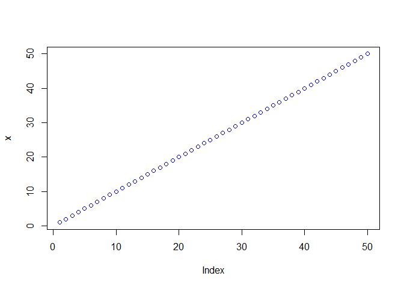
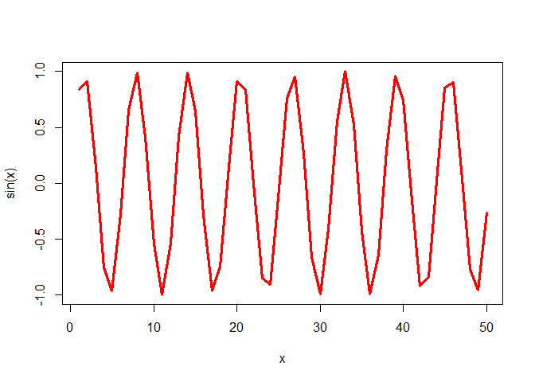

# Class 4 Lab
Shazreh Hassan

``` r
#This is my first r script
x <- 1:50
plot(x)
```


``` r
plot(x, col="blue")
```



``` r
plot(x, sin(x))
```


``` r
plot(x, sin(x), typ="l", col="red", lwd=3)
```



``` r
log(10)
```

    [1] 2.302585

``` r
log(10, base=10)
```

    [1] 1
